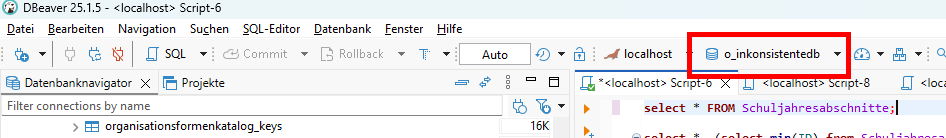
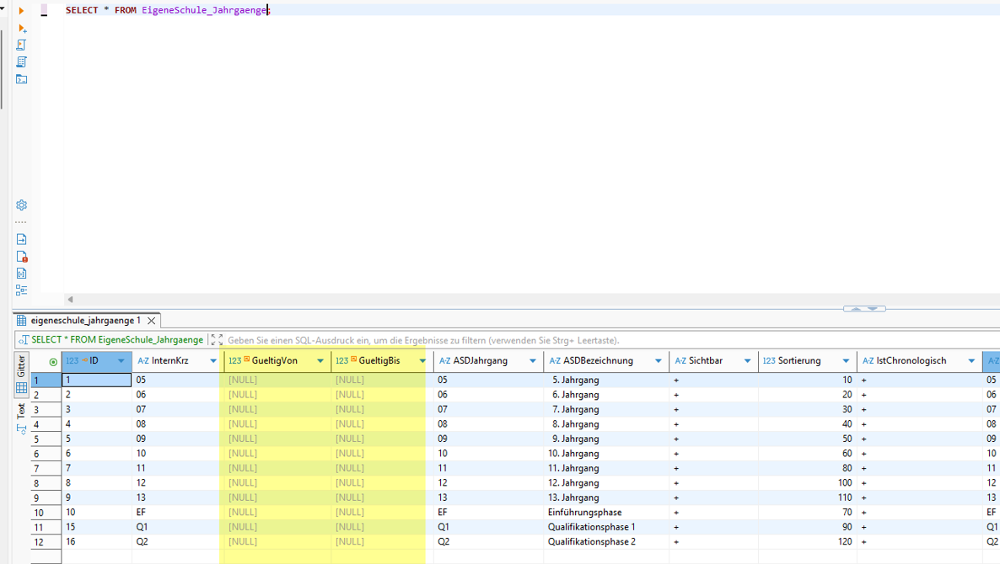
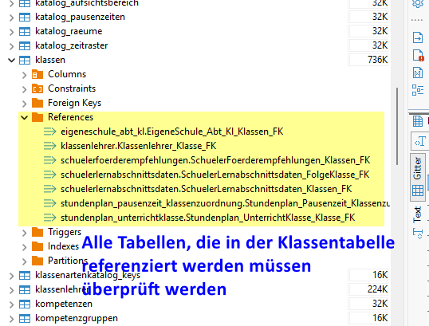
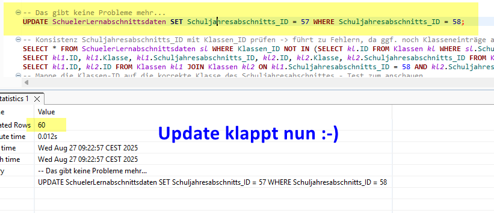
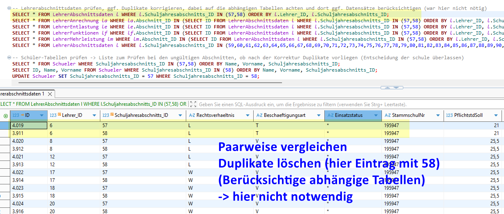

# Inkonsistente Datenbank reparieren

Im folgenden wird die Reparatur einer SVWS-MariaDB anhand eines Beispiels erläutert. Die Anleitung ist für interessierte Fachberater vorgesehen. 


## Problem: Mehrfacheinträge bei den Schuljahresabschnitten.


  


## Bearbeitung mit Hilfe von SQL-Befehlen in DBeaver
Um Einträge zu sichten und zu korrigieren wird mit SQL-Befehlen gearbeitet. Ein manuelles Sichten und Korrigieren ist fehleranfällig.

Öffne SQL-Skript in DBeaver:

  


Wähle die korrekte Datenbank aus, auf die sich die Befehle beziehen sollen:

  

Tipps: 
- SQL-Befehle sukzessive aufbauen
- Ausführen einzelner SQL-Befehle in DBeaver mit Strg + Enter

## 1. Sichte und korrigiere die Schuljahresabschnitte
Mi Hilfe einer SELECT-Anweisung sollte man sich zunächst einen Überblick über die Tabelle Schuljahresabschnitte verschaffen:

``` sql
select * FROM Schuljahresabschnitte;
```

**Ergebnis:**
  


## 2. Korrigiere die Spalte VorigenAbschnitte in der Tabelle Schuljahresabschnitte:

### Zunächst für das 1. HJ 
Hier: SchuljahresabschnittsID 57 und 58 sind betroffen

**In SQL:**
``` sql
select *, 
    (select min(ID) from Schuljahresabschnitte s2 
    where s2.Abschnitt = 2 and s2.jahr = s1.jahr-1 ) as vID 
from Schuljahresabschnitte s1 
where 
    (s1.Abschnitt = 1 and 
    (select min(ID) from Schuljahresabschnitte s2 
     where s2.Abschnitt = 2 and s2.jahr = s1.jahr-1) 
    is not null);

```
  

**Ergebnis:**
  

Alle SQL-Befehle im Überblick:
``` sql
select *, (select min(ID) from Schuljahresabschnitte s2 where s2.Abschnitt = 2 and s2.jahr = s1.jahr-1 ) as vID from Schuljahresabschnitte s1 
where (s1.Abschnitt = 1 and (select min(ID) from Schuljahresabschnitte s2 where s2.Abschnitt = 2 and s2.jahr = s1.jahr-1) is not null);

update Schuljahresabschnitte s1 set s1.VorigerAbschnitt_ID = (select min(ID) from Schuljahresabschnitte s2 where s2.Abschnitt = 2 and s2.jahr = s1.jahr-1) 
where (s1.Abschnitt = 1 and (select min(ID) from Schuljahresabschnitte s3 where s3.Abschnitt = 2 and s3.jahr = s1.jahr-1) is not null);

update Schuljahresabschnitte s1 set s1.VorigerAbschnitt_ID = null 
where (s1.Abschnitt = 1 and (select min(ID) from Schuljahresabschnitte s3 where s3.Abschnitt = 2 and s3.jahr = s1.jahr-1) is null);
```
### Analog für das zweite Halbjahr

Welche VorigenAbschnitte sind falsch? --> select
 

Nach erster Update-Anweisung:
 

**Ergebnis:**
 

**In SQL:**
``` sql
select *, (select min(ID) from Schuljahresabschnitte s2 where s2.Abschnitt = 1 and s2.jahr = s1.jahr) as vID from Schuljahresabschnitte s1 
where (s1.Abschnitt = 2 and (select min(ID) from Schuljahresabschnitte s2 where s2.Abschnitt = 1 and s2.jahr = s1.jahr) is not null);

update Schuljahresabschnitte s1 set s1.VorigerAbschnitt_ID = (select min(ID) from Schuljahresabschnitte s2 where s2.Abschnitt = 1 and s2.jahr = s1.jahr) 
where (s1.Abschnitt = 2 and (select min(ID) from Schuljahresabschnitte s3 where s3.Abschnitt = 1 and s3.jahr = s1.jahr) is not null);

update Schuljahresabschnitte s1 set s1.VorigerAbschnitt_ID = null 
where (s1.Abschnitt = 2 and (select min(ID) from Schuljahresabschnitte s3 where s3.Abschnitt = 1 and s3.jahr = s1.jahr) is null);
```

## 3. Korrigiere die Spalte Folgeabschnitt 
Analog zur Korrektur der Spalte VorigenAbschnitte: Erst für das erste HJ dann für das zweite HJ


Für das erste HJ
 

Update und analog das zweite HJ

**In SQL:**
```sql
select *, (select min(ID) from Schuljahresabschnitte s2 
where s2.Abschnitt = 2 and s2.jahr = s1.jahr) as fID from Schuljahresabschnitte s1 
where (s1.Abschnitt = 1 and (select min(ID) from Schuljahresabschnitte s3 where s3.Abschnitt = 2 and s3.jahr = s1.jahr) is not null);

update Schuljahresabschnitte s1 set s1.FolgeAbschnitt_ID = (select min(ID) from Schuljahresabschnitte s2 where s2.Abschnitt = 2 and s2.jahr = s1.jahr) 
where (s1.Abschnitt = 1 and (select min(ID) from Schuljahresabschnitte s3 where s3.Abschnitt = 2 and s3.jahr = s1.jahr) is not null);

update Schuljahresabschnitte s1 set s1.FolgeAbschnitt_ID = null 
where (s1.Abschnitt = 1 and (select min(ID) from Schuljahresabschnitte s3 where s3.Abschnitt = 2 and s3.jahr = s1.jahr) is null);

select *, (select min(ID) from Schuljahresabschnitte s2 where s2.Abschnitt = 1 and s2.jahr = s1.jahr+1) as fID from Schuljahresabschnitte s1 
where (s1.Abschnitt = 2 and (select min(ID) from Schuljahresabschnitte s2 where s2.Abschnitt = 1 and s2.jahr = s1.jahr+1) is not null);

update Schuljahresabschnitte s1 set s1.FolgeAbschnitt_ID = (select min(ID) from Schuljahresabschnitte s2 where s2.Abschnitt = 1 and s2.jahr = s1.jahr+1) 
where (s1.Abschnitt = 2 and (select min(ID) from Schuljahresabschnitte s3 where s3.Abschnitt = 1 and s3.jahr = s1.jahr+1) is not null);

update Schuljahresabschnitte s1 set s1.FolgeAbschnitt_ID = null 
where (s1.Abschnitt = 2 and (select min(ID) from Schuljahresabschnitte s3 where s3.Abschnitt = 1 and s3.jahr = s1.jahr+1) is null);
```

## 4. Welchen Einfluss hat die Schuljahresabschnittstabelle auf andere Tabellen (References)
 

**Sinnvolle Reihenfolge für die Korrektur:**<br>
Ein Blick in die fehlerhafte Tabelle **Schuljahresabschnitte** zeigt, welche Tabellen von den fehlerhaften Mehrfach-Einträgen betroffen sind (References). Die referenzierten Tabellen können wiederum referenzierte Tabellen haben, die ggf. korrigiert werden müssen.

 

## 5. Korrektur EigeneSchule
Stelle sicher, dass in eigeneSchule die kleinste ID für den aktuellen Abschnitt steht. <br>In Schuljahresabschnitte sind für 2025.1 mehrere IDs --> wir legen die korrekte als die Kleinste fest


**In SQL:**
```sql
SELECT Schuljahresabschnitts_ID FROM EigeneSchule es;
UPDATE EigeneSchule SET Schuljahresabschnitts_ID = (
	SELECT min(alt.ID) FROM Schuljahresabschnitte alt 
		JOIN (SELECT tmp.ID, tmp.Jahr, tmp.Abschnitt FROM Schuljahresabschnitte tmp WHERE tmp.ID = (SELECT Schuljahresabschnitts_ID FROM EigeneSchule)) AS neu
		ON alt.Jahr = neu.Jahr AND alt.Abschnitt = neu.Abschnitt
);

```


## 6. EigeneSchule_Jahrgaenge
Bei gueltigVon und gueltigBis sind keinen Einträge 
d.h. Jahrgänge sind für alle Abschnitte gültig.<br>
Ansonsten würde hier eine AbschnittsID drin stehen. Diese ggf. per Hand oder mit sql Befehl wie in Schritt 1 korrigieren.
 


## 7. Klassentabelle
Welcher weiteren Tabellen werden dort referenziert? 
Diese müssen ggf. auch angepasst werden (rekursive Überprüfung)

 


**Ziel:** <br>
Zusammenfassen der Klasseninfos, welche sich auf den Schuljahresabschnitt mit der kleinsten ID bei gleichem Jahr und Abschnitt beziehen, auf die Klassen mit der kleinsten ID.

Insgesamt müssen folgenden Dinge in der Klassentabelle geprüft werden (siehe unten):

 

### Überblick verschaffen
Welche Schuljahre sind betroffen? Wo ist mehr als ein Abschnitt vorhanden?

 

 

**In SQL:**
```sql
SELECT Jahr, Abschnitt FROM SchuljahresAbschnitte GROUP BY Jahr, Abschnitt HAVING count(*) > 1;
SELECT group_concat(ID) FROM SchuljahresAbschnitte GROUP BY Jahr, Abschnitt HAVING count(*) > 1;
```

Übersichtlicher:

 


**In SQL:**
```sql
SELECT ID, Jahr, Abschnitt FROM SchuljahresAbschnitte 
WHERE (Jahr, Abschnitt) IN 
     (SELECT Jahr, Abschnitt FROM SchuljahresAbschnitte 
      GROUP BY Jahr, Abschnitt HAVING count(*) > 1);
```

### Korrigiere doppelte Einträge in der Klassentabelle für das gleiche HJ
Hier gibt es im 1. HJ für 57 und 58 einen Eintrag. 
Nach einer Manuellen Prüfung, ob die Einträge identisch sind, müssen noch die referenzierten Tabellen korrigiert werden. Später können die Klassen mit ID = 58 gelöscht werden

 

**In SQL:**
```sql
SELECT * FROM Klassen WHERE Schuljahresabschnitts_ID IN (57,58) ORDER BY Klasse, Schuljahresabschnitts_ID;
```

## 7.1 EigeneSchuleAbteilungen

**Schritt 1** <br>
Klassenzuordnungen zu Abteilungen prüfen

**In SQL:**
```sql
SELECT * FROM EigeneSchule_Abteilungen 
WHERE Schuljahresabschnitts_ID IN (57,58);
```
**Ergebnis**<br>


**Schritt 2** <br>
Da alle Einträge für die ID 57 gleich der ID 58 sind, können nun die Einträge mit 58 gelöscht werden
 Erst unten markieren, dann auf Entf und save:


## 7.2 Klassenlehrer bei den Abteilungen

**In SQL:**
```sql
SELECT abtkl.*, k.* FROM EigeneSchule_Abt_KL abtkl JOIN Klassen k ON abtkl.Klassen_ID = k.ID AND k.Schuljahresabschnitts_ID IN (57,58) ORDER BY k.Klasse, k.Schuljahresabschnitts_ID;
```

**Ergebnis**<br>


## 7.3 SchuelerFoerderempfehlung
**In SQL:**
```sql
SELECT * FROM SchuelerFoerderempfehlungen WHERE Klassen_ID IN
     SELECT ID FROM Klassen 
     WHERE Schuljahresabschnitts_ID IN  (57,58) 
     ORDER BY Klasse, Schuljahresabschnitts_ID);
```
-> keine Daten vorhanden und somit keine Korrektur notwendig

## 7.4 Stundenplan_Pausenzeit

**In SQL:**
```sql
SELECT * FROM Stundenplan_Pausenzeit;
```
-> keine Daten vorhanden und somit keine Korrektur notwendig

## 7.5 Stundenplan_Unterrichtsklasse

**In SQL:**
```sql
SELECT * FROM Stundenplan_Unterrichtklasse 
WHERE Klasse_ID IN (
    SELECT ID FROM Klassen 
    WHERE Schuljahresabschnitts_ID IN (57,58) 
    ORDER BY Klasse, Schuljahresabschnitts_ID);
```
-> keine Daten vorhanden und somit keine Korrektur notwendig

## 7.6 SchuelerLernabschnittsdaten

**In SQL:**
```sql
SELECT * FROM SchuelerLernabschnittsdaten 
WHERE Klassen_ID IN 
   (SELECT ID FROM Klassen WHERE Schuljahresabschnitts_ID IN (57,58) 
    ORDER BY Klasse, Schuljahresabschnitts_ID);
```

**Ergebnis**<br>


Änderung in SQL führen zu einem Fehler:
```sql
UPDATE SchuelerLernabschnittsdaten SET Schuljahresabschnitts_ID = 57 WHERE Schuljahresabschnitts_ID = 58;
```

**Fehlermeldung** <br>
SQL-Fehler [1062] [23000]: (conn=868) Duplicate entry '5535-57-0' for key 'SchuelerLernabschnittsdaten_UC1'

**Lösung** <br>
Schritt 1: Welche Lernabschnitte sind betroffen?

**In SQL:**
```sql
SELECT * FROM SchuelerLernabschnittsdaten 
WHERE Schuljahresabschnitts_ID IN (57, 58)AND Schueler_ID IN 
  (SELECT Schueler_ID FROM 
      (SELECT * FROM SchuelerLernabschnittsdaten 
       WHERE Schuljahresabschnitts_ID IN (57, 58)) sl2 
   GROUP BY Schueler_ID HAVING count(*) > 1)
ORDER BY Schueler_ID, Schuljahresabschnitts_ID;
```

**Ergebnis**


Überprüfe die Leistungsdaten  zur jeweils gleichen SchüleriD <br>
Steht bei Schüler 5535 sowohl für SchuljahresabschnittsID 57 als auch 58 das gleich?

**In SQL:**
```sql
SELECT * FROM SchuelerLeistungsdaten WHERE Abschnitt_ID 
IN (60730, 59561);
```

**Ergebnis** <br>
Keine Leistungsdaten vorhanden 


Prüfe analog für die beiden anderen Schüler:


Nun können doppelte Einträge gelöscht werden:


Jetzt erneut den Update Befehl von oben
**In SQL:**
```sql
UPDATE SchuelerLernabschnittsdaten SET Schuljahresabschnitts_ID = 57 WHERE Schuljahresabschnitts_ID = 58;
```

**Ergebnis**


## 8. Konsistenz Schuljahresabschnitts_ID mit Klassen_ID prüfen
Suche alle Schuelerlernabschnitte bei denen Klassen mit falschem Schuljahresabschnitt eingetragen sind 

**In SQL:**
```sql
SELECT * FROM SchuelerLernabschnittsdaten sl 
WHERE Klassen_ID NOT IN 
  (SELECT kl.ID FROM Klassen kl 
   WHERE sl.Schuljahresabschnitts_ID = kl.Schuljahresabschnitts_ID);
```
**Ergebnis**


Liste alle Klassen auf, bei denen hier Probleme auftreten <br>
--> alle Klassen, die für Schuljahresabschnitt 57 und 58 vorhanden sind 

**In SQL:**
```sql
SELECT kl1.ID, kl1.Klasse, kl1.Schuljahresabschnitts_ID, kl2.ID, kl2.Klasse, kl2.Schuljahresabschnitts_ID 
FROM Klassen kl1 JOIN Klassen kl2 ON kl1.Schuljahresabschnitts_ID = 58 AND kl2.Schuljahresabschnitts_ID = 57 
AND kl1.Klasse = kl2.Klasse;
```

**Ergebnis**


Prüfe: Haben diese Klassen alle unterschiedliche IDs?

**In SQL:**
```sql
SELECT kl1.ID, kl2.ID FROM Klassen kl1 JOIN Klassen kl2 
ON kl1.Schuljahresabschnitts_ID = 58 
AND kl2.Schuljahresabschnitts_ID = 57 
AND kl1.Klasse = kl2.Klasse;
```

**Ergebnis**


Mappe die Klassen-ID auf die korrekte Klasse des Schuljahresabschnittes - Test zum anschauen

**In SQL:**
```sql
SELECT 
   (SELECT zu FROM 
      (SELECT kl1.ID AS von, kl2.ID AS zu 
       FROM Klassen kl1 JOIN Klassen kl2 
       ON kl1.Schuljahresabschnitts_ID = 58 
       AND kl2.Schuljahresabschnitts_ID = 57 
       AND kl1.Klasse = kl2.Klasse) tmp 
    WHERE von = sl.Klassen_ID) AS zielID, 
sl.* FROM SchuelerLernabschnittsdaten sl 
WHERE Klassen_ID IN 
   (SELECT kl1.ID FROM Klassen kl1 JOIN Klassen kl2 
    ON kl1.Schuljahresabschnitts_ID = 58 
    AND kl2.Schuljahresabschnitts_ID = 57 
    AND kl1.Klasse = kl2.Klasse);
```

**Ergebnis**


Mappe die Klassen-ID auf die korrekte Klasse des Schuljahresabschnittes – Durchführung
**In SQL:**
```sql
UPDATE SchuelerLernabschnittsdaten sl SET sl.Klassen_ID = (SELECT zu FROM (SELECT kl1.ID AS von, kl2.ID AS zu FROM Klassen kl1 JOIN Klassen kl2 ON kl1.Schuljahresabschnitts_ID = 58 AND kl2.Schuljahresabschnitts_ID = 57 AND kl1.Klasse = kl2.Klasse) tmp WHERE von = sl.Klassen_ID)
WHERE Klassen_ID IN (SELECT kl1.ID FROM Klassen kl1 JOIN Klassen kl2 ON kl1.Schuljahresabschnitts_ID = 58 AND kl2.Schuljahresabschnitts_ID = 57 AND kl1.Klasse = kl2.Klasse);
```
Nach Ausführen des Befehls steht die korrekte KlassenID in den Schuelerlernabschnittsdaten: 


Nach zwei weiteren Prüfungen, bei denen hier keine Einträge vorhanden sind, können die Klassen mit SchuljahresabschnittsID 58 gelöscht werden:


**In SQL:**
```sql
DELETE FROM Klassen WHERE Schuljahresabschnitts_ID IN (58);
```

## 9. Schuljahr 2025.2
Ganz analog für die anderen nicht eindeutigen SchulabschnittsIDs:


## 10. Gost_Klausurtermine prüfen

**In SQL:**
```sql
SELECT * FROM Gost_Klausuren_Termine 
WHERE Schuljahresabschnitt_ID IN (57,58);
SELECT * FROM Gost_Klausuren_Termine 
WHERE Schuljahresabschnitt_ID IN (59,60,61,62,63,64,65,66,67,68,…
```

**Ergebnis**<br>
Keine Einträge, daher keine Korrektur notwendig

## 11. Lehrerabschnittsdaten



**In SQL:**
```sql
SELECT * FROM LehrerAbschnittsdaten l 
WHERE l.Schuljahresabschnitts_ID IN (57,58) 
ORDER BY l.Lehrer_ID, l.Schuljahresabschnitts_ID;
```

Abhängige Tabellen berücksichtigen 
(besser vor dem Löschen von 58 bei den LehrerAbschnittsdaten):


## 12 Weitere Überprüfungen

