# Installation von WebLuPo unter Windows

Hier eine Anleitung für interessierte Fachberater, die LuPo für Testzwecke auf Ihrem privaten Windows-Rechner installieren möchten.

## Download von Lupo

zip-Datei von der SVWS-Github Seite herunterladen:
https://github.com/SVWS-NRW/SVWS-Server/releases/tag/v1.0.12

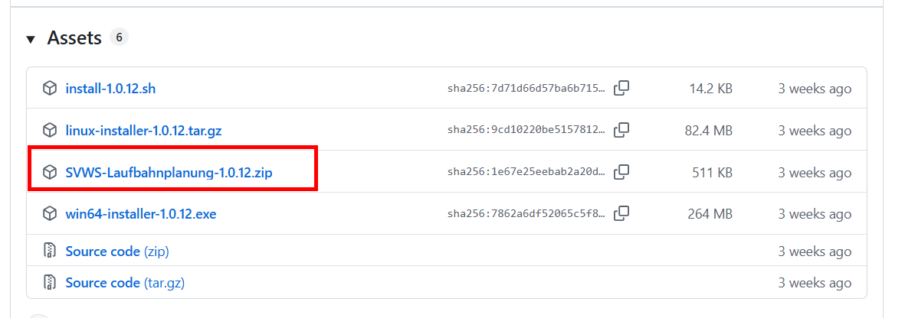  

Die zip-Datei ist nun im Download-Ordner. Entpacken können wir später. Erstmal muss ein Webserver installiert werden, damit Lupo mit einem normalen Browser geöffnet werden kann. 
Ziel ist es, dass mit dem Aufruf von https://localhost/lupo im Browser die Nutzung von WebLuPo möglich ist. Dazu benutzen wir Apache. Um das Starten und Konfigurieren der Lupo-Webseite einfach zu halten, nutze ich im folgenden das Hilfsprogramm XAMPP. Damit kann der Lupo-Server gestartet und gestoppt werden. Weiter können auch sehr einfach Ports angepasst werden. Dazu aber später mehr. 
 

## Xampp runterladen und installieren
Download von der offiziellen Seite: https://www.apachefriends.org/download.html  
Es genügt, wenn Apache hier ausgewählt ist. Den Rest braucht man für die Nutzung von Lupo nicht.

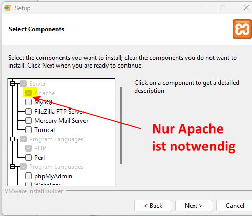  

## Anpassungen in XAMPP

 
Im Ordner **C/XAMPP/htdocs** wird ein neuer Ordner erstellt. Der Name des neu erstellten Ordners wird später im Browser erscheinen. Ich nenne ihn im folgenden "lupo".
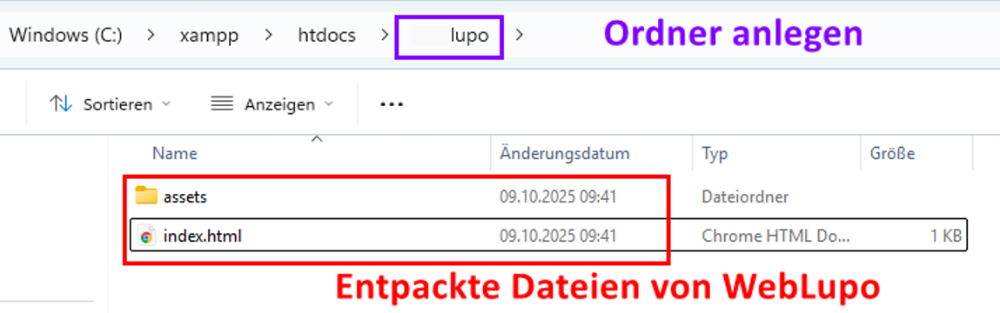  

**zip-Datei entpacken**   
Nun wird die bereits heruntergeladene Datei SVWS-Laufbahnplanung-1.0.12.zip in den neu erstellten Ordner entpackt.

## Starten von XAMPP
XAMPP kann über den Windows-Startbutton geöffnet werden:
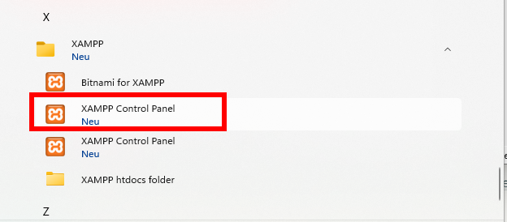 

Sofern bei der Installation von XAMPP nur Apache ausgewählt wurde, sieht das Programm so aus: 

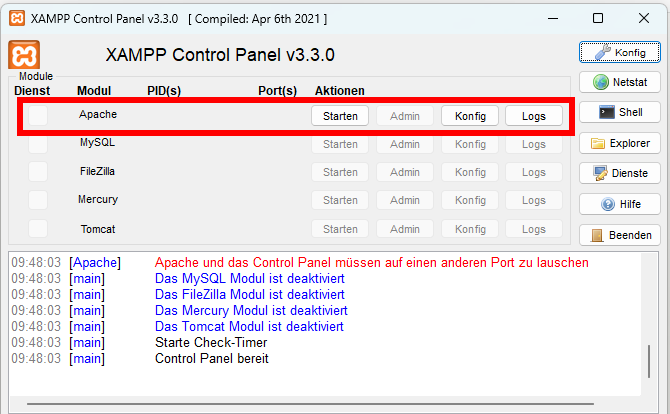 

Wenn beim Klick auf Starten von Apache die folgende Fehlermeldung erscheint, müssen die Ports noch angepasst werden. Insbesonere wenn der SVWS-Server ebenfalls local auf dem Windows-Rechner installiert wurde, ist der Port 443 sehr wahrscheinlich bereits belegt:

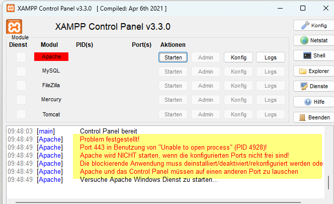 

**Portanpassung für http**   
Öffne die Datei "httpd.conf" und ändere den Port von 80 auf z.B. 8080

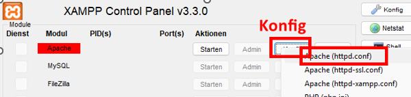

Folgende zwei Änderungen müssen eingepflegt werden:   

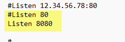

**Portanpassung für https**   
Öffne die Datei "httpd-ssl.conf" und ändere den Port von 443 auf z.B. 8443

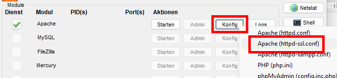

Folgende zwei Änderungen müssen eingepflegt werden   

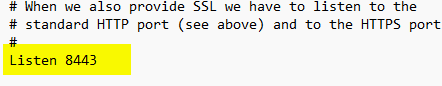

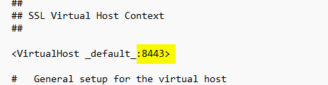

## Apache starten
Der Webserver kann nun über Apache-Start Button gestartet werden:
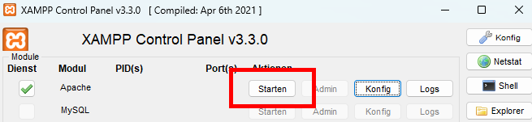

Das Apachemodul erscheint grün, wenn der Start erfolgreich war:
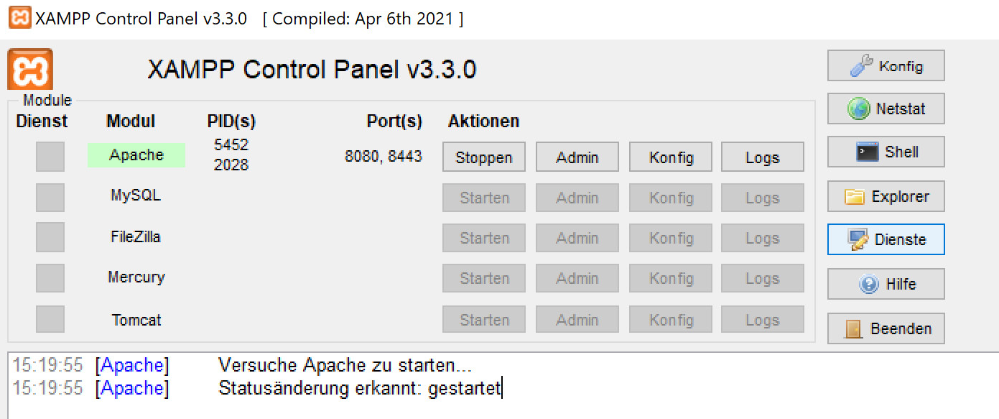

## Lupo Öffnen
Nun kann Lupo im Browser geöffnet werden. Entweder unverschlüsselt mit http:
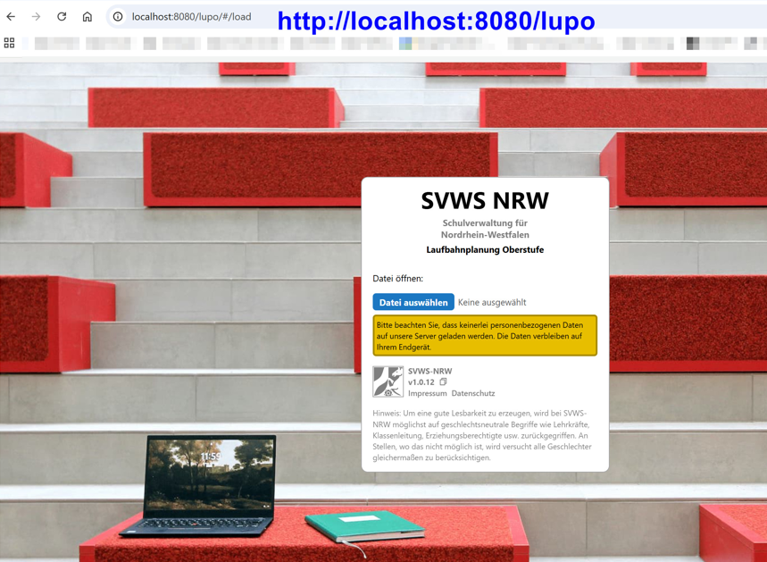

Oder über https:
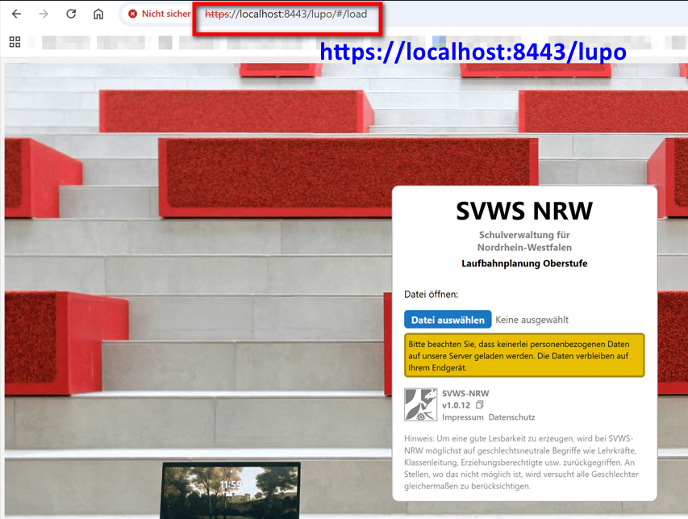
