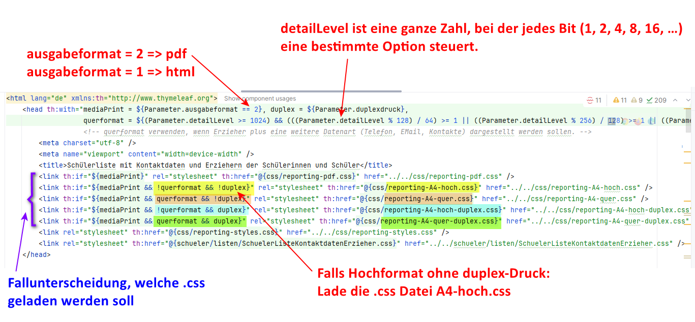
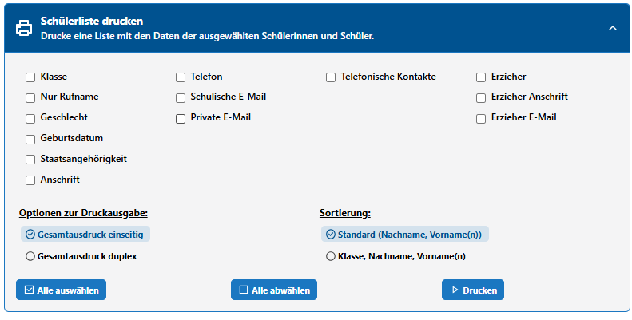
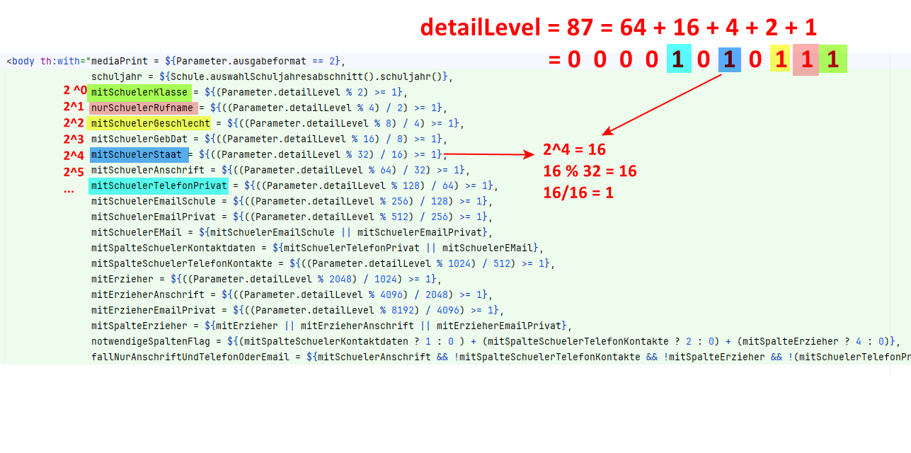
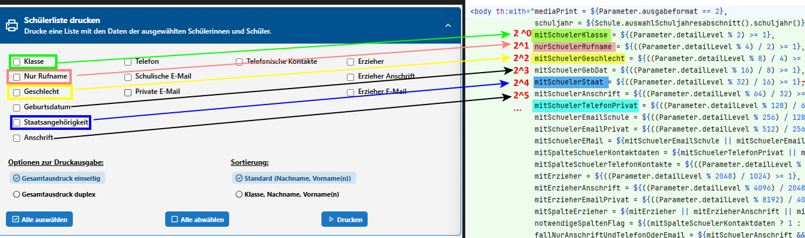
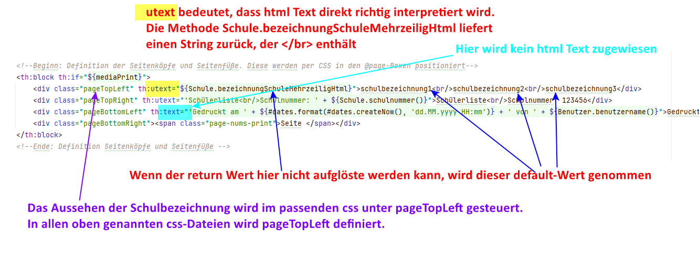
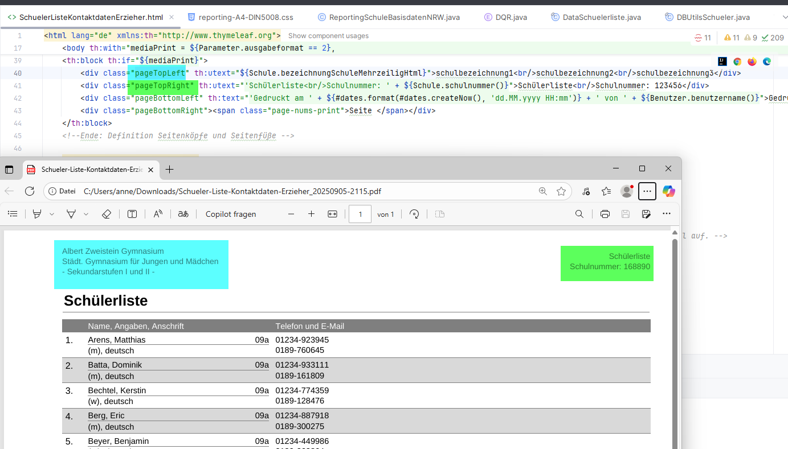
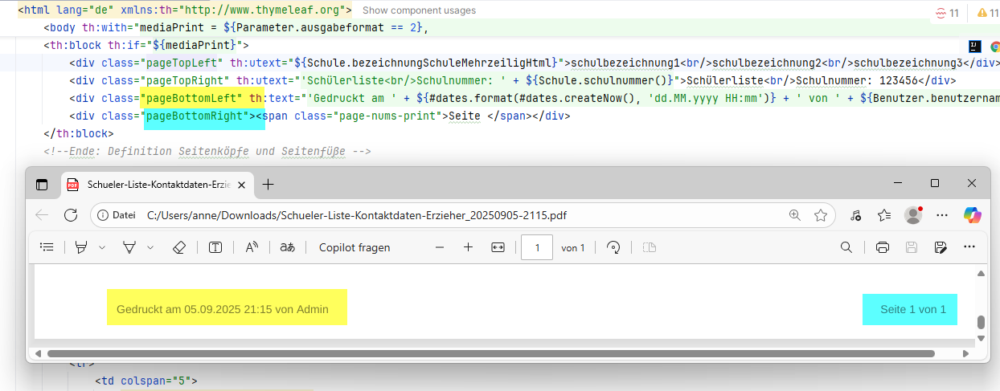
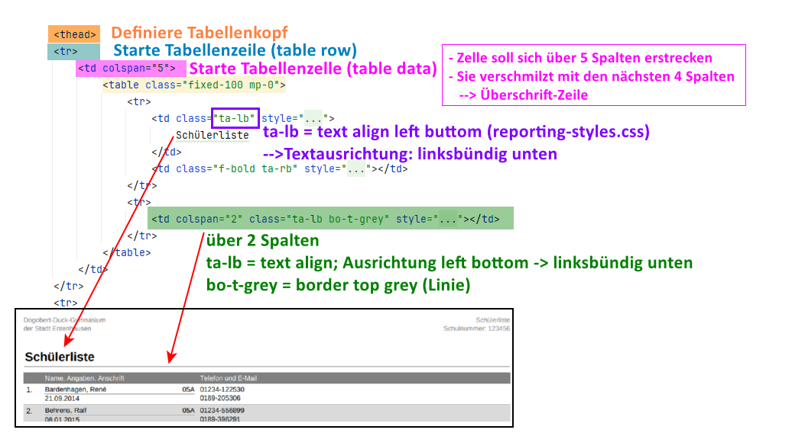
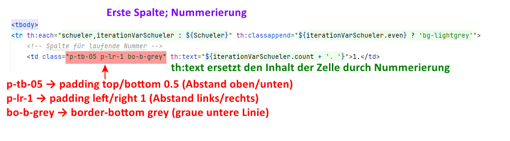
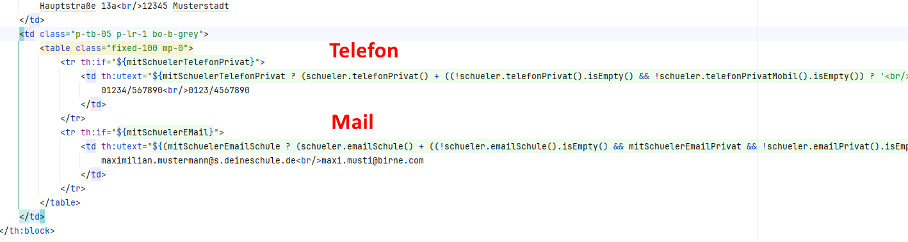

# Erläuterungen zum Report SchuelerlisteKontaktdatenErzieher.html  

Im folgenden wird der Aufbau des Reports erläutert, welcher für das Drucken von Schülerlisten genutzt wird. Es handelt sich um ein html-Dokument mit der Erweiterung Thymeleaf.

Im Projekt findet man den Report hier:

  

## Html-Kopf

  

Die css Vorlagen

+ Reporting-A4-hoch,
+ Reporting-A4-quer.css,
+ Reporting-A4-hoch-duplex.css,
+ reporting-A4-quer-duplex.css und
+ reporting-styles.css

können von allen Reports referenziert werden und liegen im Ordner css. Dort gibt es noch weitere Vorlagen.  

Die Vorlage SchuelerListeKontaktdatenErzieher.css ist speziell nur für diesen Report und liegt im selben Ordner wie die html-Datei. Möchte man beispielsweise eine andere Schriftart als in den allgemeingültigen Vorlagen, kann man diese hier überschreiben.
Die Zeile

``` html
<link rel="stylesheet" th:href="@{schueler/listen/SchuelerListeKontaktdatenErzieher.css}…
```

muss daher als letztes gesetzt werden.

### Infos zu den oben verwendeten Thymeleaf-Attributen

**th:with**

+ mit th:with kann man lokale Variablen deklarieren
+ Bereich = aktuelles Element + alle Kindelemente
+ Gut für: bessere Lesbarkeit, Wiederverwendung, Performance
+ Hier: th:with berechnet die Variable mediaPrint einmal am Anfang; man kann sie im ganzen Body nutzen

**Syntax**

``` html
<head th:with="varName1 = ${expression1}, varName2 = ${expression2}">
    ... Hier kannst du ${varName1} und ${varName2} benutzen ...
</head> 
```


## HTML-Body – Auswahlboxen

Gemeint ist diese Auswahl im Client:


Über **detailLevel** wird bestimmt, welche Auswahlboxen ausgewählt wurden.


Mit th:with werden die lokalen Variablen schuljahr, mitSchulerKlasse,… definiert. Diese werden später in Abfragen genutzt.



### Block: Köpfe und Füße

**Thymeleaf-Attribut: utext (Html interpretieren und direkt ausgeben)**<br>
utext für Texte, die html-Code enthalten. Ist der html Text null, wird ein Default-Wert genommen:<br>
th:utext="${Methode, die Text mit html-Elementen zurückgibt}">Defaultwert, falls leer

**Thymeleaf-Attribut: text**
Gibt text so aus, wie er ist. Html wird als Text angezeigt, nicht interpretiert.



**pageTopLeft**<br>
Hier sieht man, wo pageTopLeft definiert ist:


**Methode bezeichnungSchuleMehrzeiligHtml**<br>


Insgesamt folgt aus dem Block:

**Kopf**



**Fuß**



Schrift und Position sind in reporting-A4.hoch.css … festgelegt.

## Tabelle
**Thymeleaf-Attribut: if**<br>
Zeigt Element nur an, wenn Bedingung true ist.

**colgroup**


### Tabellenkopf



### Tabellendaten

**Thymeleaf-Attribut: each (Schleife)** <br>

```css
th:each="schueler, iterationVarSchueler : ${Schueler}"
```

Bedeutung: Iteriere über alle Schüler in der Liste ${Schueler}.
Für jedes Element setze schueler = aktueller Schüler. <br>
iterationVarSchueler = Metadaten zur Schleife.

Zu interationVarSchueler<br>
**Thymeleaf-Attribut: classappend**<br>

```css
th:classappend="${iterationVarSchueler.even} ? 'bg-lightgrey'">
```

Jede zweite Zeile bekommt automatisch die CSS-Klasse bg-lightgrey.
Allgemein:

```css
th:classappend = „CSS-Klasse(n) anhängen, wenn Bedingung erfüllt ist.“
```

#### 1. Spalte: Nummerierung



#### Rufname, Klasse, Geschlecht, Geburtsdatum, Staatsangehörigkeit

(falls nur Anschrift und Telefon oder Mail)


#### Adresse

(immer noch falls nur Anschrift und Telefon oder Mail)


#### Telefon und Mail

(immer noch falls nur Anschrift und Telefon oder Mail)


#### Regelfall: wenn nicht nur Anschrift und Telefon oder Mail


...
