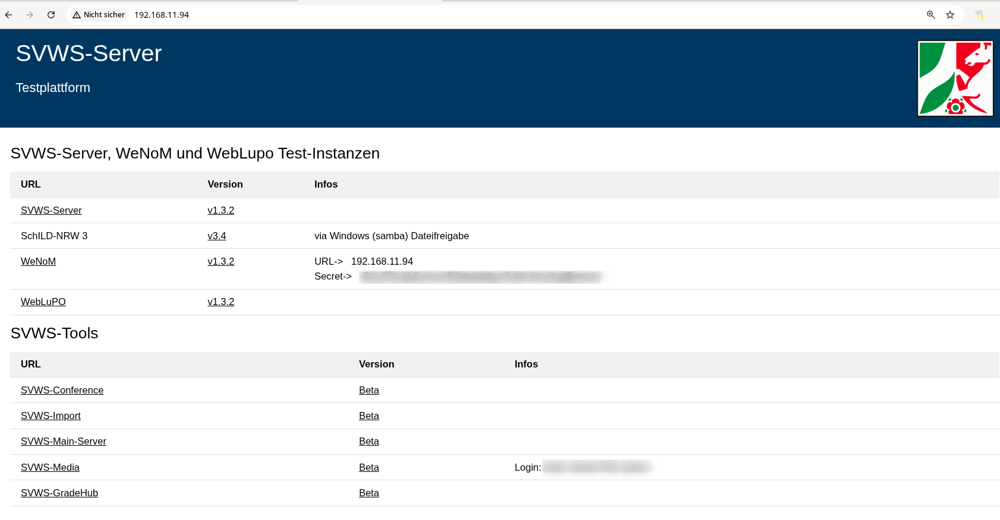

# Installationsskripte Test- bzw. Schulungsserver

Hier eine reduzierte Sammlung grundlegender Skripte zu Installation verschiedener Test- bzw. Schulungsserver: 

+ SVWS-Server mit dem Linuxinstaller
+ SVWS-Server unter docker
+ Wenom-Server
+ Weblupo
+ Svws-Tool: SVWS-Media, SVWS-Gradehub, SVWS-Conference, SVWS-Import, ... 

Alle Skripte sind mit **Debian 13** getestet und sollten auf einer einfachen Basisinstallation erfolgreich druchlaufen können. Es folgen nun Erläuterungen und Beispiele der einzelnen Skripte.

## download_all_scripts.sh

Mit diesen Skript kann man alle in diesem Githubordner befindlichen Skripte herunterladen: 

```bash 
wget https://github.com/SVWS-NRW/Schulungsunterlagen/raw/refs/heads/master/Fachberatung_Anleitungen/Schulungsserver/Installationsskripte/download_all_scripts.sh
bash download_all_scripts.sh
```
**Download** -> [download_all_scripts.sh](https://github.com/SVWS-NRW/Schulungsunterlagen/raw/refs/heads/master/Fachberatung_Anleitungen/Schulungsserver/Installationsskripte/download_all_scripts.sh)

## install_svws_testserver_linuxinstaller

Dieses Skript benutzt zur Installation den auf Github veröffentlichen Linuxinstaller des SVWS-Servers und setzt lediglich die Werte vorab in die .env Date, sodass die Installation kürzer und ohne Abfragen geskriptet werden kann. 

**Optionen:** 

| Parameter | Info |
|-|-|
| -v | Obligatorisch: SVWS-Server Versionsnummer |
| -p | Optional: Passwort der MariaDB und des Keystores, falls nicht angegeben wird eines generiert. |

**Beispiel:** 

```bash 
bash install_svws_testserver_docker.sh -p svwsadmin -v 1.3.2 -o svws
```
**Download** -> [install_svws_testserver_docker.sh](https://github.com/SVWS-NRW/Schulungsunterlagen/raw/refs/heads/master/Fachberatung_Anleitungen/Schulungsserver/Installationsskripte/install_svws_testserver_docker.sh)


## install_svws_testserver_docker.sh

Diese Skript installiert unter dem Basefolder `/docker`in einem noch anzugebenden Verzeichnis einen SVWS-Server inkl. MariaDB in einem Docker mit dem angegebnen Passwort. Das Passwort ist dann für MariaDB und SVWS-Server gleich. Es wird am Ende des Skripts eine Testdabenbankl per curl Befehl in den SVWS-Server geladen. Dies kann ggf. vor Aufruf der Skript per Variable TESTDB_SQLITE angepasst werden. 

**Optionen:** 

| Parameter | Info |
|-|-|
| -v | Obligatorisch: SVWS-Server Versionsnummer |
| -o | Obligatorisch: Speicherordner relativ zum Basisordner `/docker`|
| -p | Optional: Passwort der MariaDB und des Keystores, falls nicht angegeben wird eines generiert. |
| -dn | Optional: Domainname, falls nicht angegeben wird der Ordnername genommen. |
| -pt | Optional: Port, falls nicht angegeben wird der 8443 genommen. |

**Beispiel:**

```bash 
bash install_svws_testserver_docker.sh -p svwsadmin -v 1.3.2 -o svws1
```

**Download** -> [install_svws_testserver_docker.sh](https://github.com/SVWS-NRW/Schulungsunterlagen/raw/refs/heads/master/Fachberatung_Anleitungen/Schulungsserver/Installationsskripte/install_svws_testserver_docker.sh)

## clone_db_in_docker_container.sh

Diese Skript klont in einem noch anzugebenden laufebdeb SVWS-Server im Docker Container die mariadb N Mal.

**Optionen:** 

| Parameter | Info |
|-|-|
| -c | Obligatorisch: Docker Container Name |
| -d | Obligatorisch: DB Name der schon vorhandenen Datenbank im SVWS-Server |
| -n | Obligatorisch: Anzahl der Klone, die erstellt werden sollen |
| -p | Optional: MariaDB Root Passwort. Falls nicht angegeben wird nach der .env Datei gesucht und das Passwort dort ausgelesen |

**Beispiel:**

```bash 
bash install_svws_testserver_docker.sh -p svwsadmin -v 1.3.2 -o svws1
```

**Download** -> [install_svws_testserver_docker.sh](https://github.com/SVWS-NRW/Schulungsunterlagen/raw/refs/heads/master/Fachberatung_Anleitungen/Schulungsserver/Installationsskripte/install_svws_testserver_docker.sh)


## install_weblupo_testserver.sh 

Diese Skript installiert einen Apache2 Webserver und richtet im Webspace den WebLupo ein. 

**Optionen:**

| Parameter | Info |
|-|-|
| -v | Obligatorisch: SVWS-Server Versionsnummer |

**Beispiel:** 

```bash
bash install_weblupo_testserver.sh -v 1.3.2
```
bash 

**Download** -> [install_weblupo_testserver.sh](https://github.com/SVWS-NRW/Schulungsunterlagen/raw/refs/heads/master/Fachberatung_Anleitungen/Schulungsserver/Installationsskripte/install_weblupo_testserver.sh)


## install_svws_schild3_svws-tools_testserver.sh

Installiert einen **all-in-one Server** mit:

+ einer Übersichtsseite inkl. Infos und links
+ SVWS-Server
+ Schild 3 in einer Windowsfreigabe
+ Wenom
+ Weblupo
+ SVWS-Conference
+ SVWS-Import
+ SVWS-Main-Server
+ SVWS-Media
+ SVWS-GradeHub



**Beispiel**: 

```bash 
bash install_svws_schild3_svws-tools_testserver.sh -o svws -v 1.3.2 -sv 3.4.0 -p YourPassword
```
Aufruf einer Installation unter den Namen und unter dem Ordner `svws`, SVWS Version : 1.3.2, Schild Version: 3.4.0, mit dem Passwort `YourPassword`. 


**Download** -> [install_svws_schild3_svws-tools_testserver.sh](https://github.com/SVWS-NRW/Schulungsunterlagen/raw/refs/heads/master/Fachberatung_Anleitungen/Schulungsserver/Installationsskripte/install_svws_schild3_svws-tools_testserver.sh)
