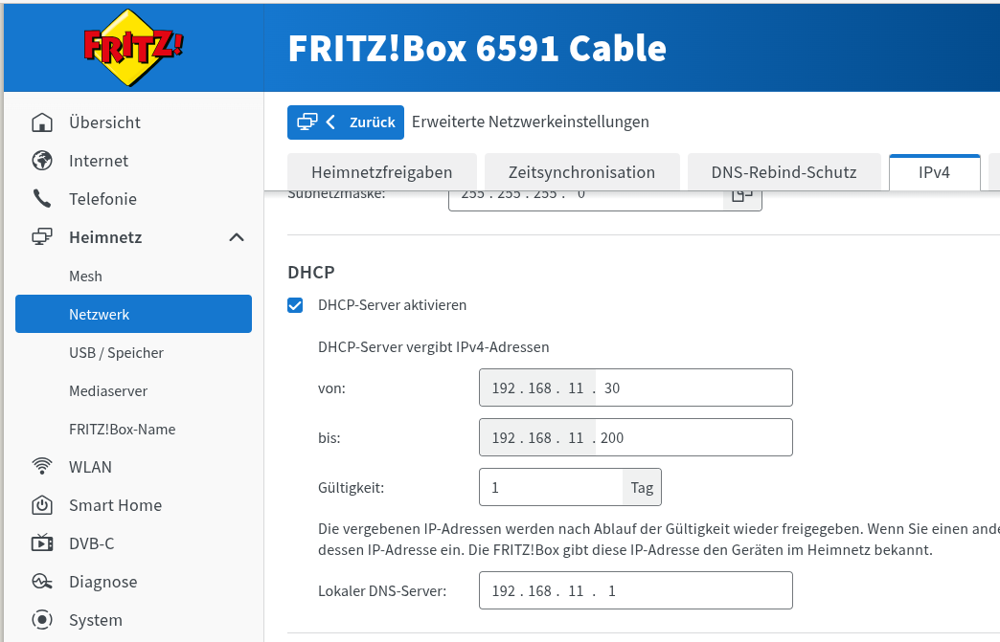
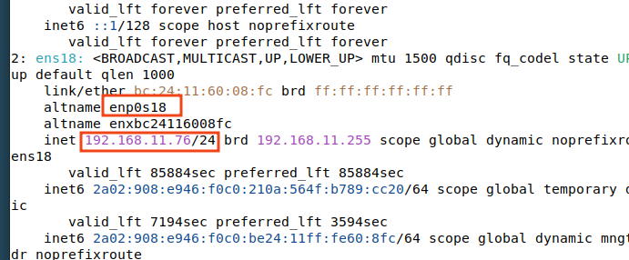
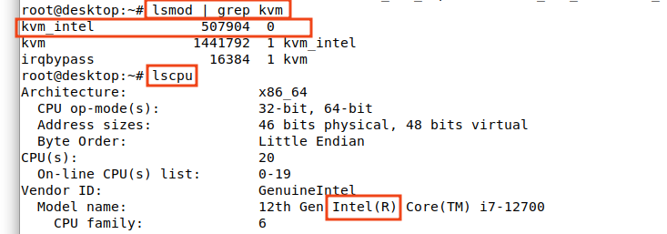
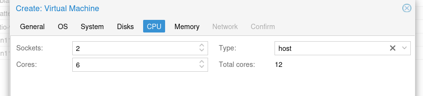
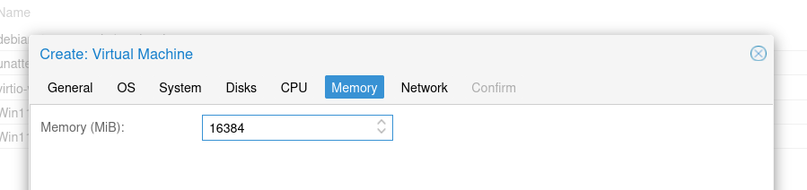
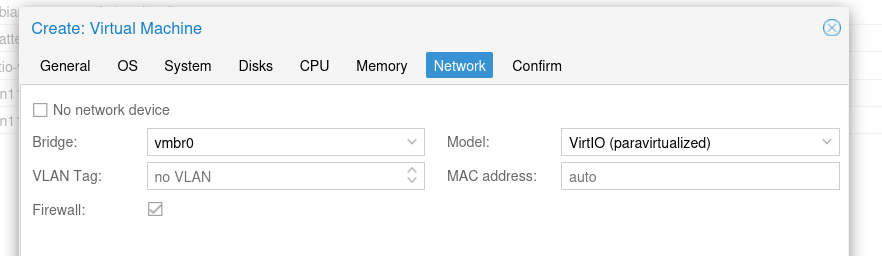

# Proxmox

Diese Anleitung beschreibt die Installation von Proxmox, das Klonen und Erstellen von Snapshots virtueller Maschinen und Linux Container sowie die Installation eines Wenom- bzw. eines SVWS-Servers. Ziel ist es, einen Einstieg in die Einrichtung von Testumgebungen für den SVWS-Server, Schild3 und die SVWS-Tools zu ermöglichen.

## Installation

Grundlage ist zunächst ein Debian 13, idealerweise mit graphischer Oberfläche. Dies ist zwar nicht in der Originalen Proxmox PVE version so voegesehen, hat jedoch den Vorteil, dass direkt mit einem Firefox die Erreichbarkeit der Webservices geprüft werden kann.

Die Installation eines Debiansystems ist in der Anleitung zu [Virtualbox](../Virtualbox/index.md) in grundlegend beschrieben. Bitte darauf hier eine grafisch Oberfläche mitinstallieren.

### Installation Proxmox auf einer Debian 13

#### Vorbereitung

##### Netzwerkkonfiguration

Der ProxmoxServer sollte eine fixe IP außerhalb der DHCP-Range des eigenen Netzwerkes erhalten, sodass sich diese nicht verändert.



Aktuelle IP Adresse und den namen des Netzwerkadapters anzeigen lassen: `ip a`



Problem: "Networkmanager ist aktiv" das ist inkompatibel mit dem Proxmoxsystem, daher durch ifupdown2 ersetzen:

```bash
systemctl stop NetworkManager
systemctl disable NetworkManager
systemctl mask NetworkManager
apt install ifupdown2
```

Hier die Statische IP, zum Beispiel 192.168.11.222 wie folgt vergeben: `nano /etc/network/interfaces` und hier folgendes eintragen:

```bash  
source /etc/network/interfaces.d/*

# The loopback network interface
auto lo
iface lo inet loopback

auto ens18
# iface ens18 inet dhcp
iface ens18 inet static
        address 192.168.11.222/24
        gateway 192.168.11.1

```

Zum schluss noch in der /etc/hosts den folgenden Eintrag vornemhen:

```bash
...
#127.0.1.1      ProxmoxServer
192.168.11.222  ProxmoxServer
...
```

#### Updates

```bash
su -
apt update && apt upgrade -y && apt autoremove -y
apt install ssh -y
reboot
```

#### Proxmoxinstallation

siehe: <https://pve.proxmox.com/wiki/Install_Proxmox_VE_on_Debian_13_Trixie>

```bash
cat > /etc/apt/sources.list.d/pve-install-repo.sources << EOL
Types: deb
URIs: http://download.proxmox.com/debian/pve
Suites: trixie
Components: pve-no-subscription
Signed-By: /usr/share/keyrings/proxmox-archive-keyring.gpg
EOL
```

```bash
wget https://enterprise.proxmox.com/debian/proxmox-archive-keyring-trixie.gpg -O /usr/share/keyrings/proxmox-archive-keyring.gpg
```

```bash
apt update && apt full-upgrade
```

```bash
apt install proxmox-default-kernel
```

```bash
reboot
```

```bash
apt install proxmox-ve postfix open-iscsi chrony
```

```bash
apt remove linux-image-amd64 'linux-image-6.12*'
```

```bash
update-grub
```

Damit ist der Proxmox PVE installiert und kann unter <https://192.168.11.222:8006> erreicht werden.

## Für Fortgeschrittene: Sofware Driven Network (SDN) in Proxmox

## Für Fortgeschrittene: Proxmox in Proxmox

Proxmox in einer VM (z.B. für die Schulungsumgenbung)
Das funktioniert gut und ist der übliche Weg, um Proxmox zu testen oder Schulungs-/Laborsysteme aufzubauen.

### Grundlegense Voraussetzungen

+ CPU mit Intel VT-x/EPT oder AMD-V/RVI
+ Auf dem Host muss Nested Virtualization aktiviert sein.
+ Die VM sollte CPU-Typ „host“ verwenden.

Nested Virtualization aktivieren

bei Intel Chipsatz:

```bash
echo "options kvm-intel nested=Y" > /etc/modprobe.d/kvm-intel.confmodprobe -r kvm_intel && modprobe kvm_intelcat /sys/module/kvm_intel/parameters/nested
```

bei AMD Chipsatz

```bash
echo "options kvm-amd nested=1" > /etc/modprobe.d/kvm-amd.confmodprobe -r kvm_amd && modprobe kvm_amdcat /sys/module/kvm_amd/parameters/nested

```

Hier ein Beispiel, wie man erkenn, welcher Prozessor in Betrieb ist und ob das Modul geladen ist.



mit `cat /sys/module/kvm_intel/parameters/nested` Y: Nested virtualisierung aktiv

### sinnvolle Einstellungen

+ RAM: mindestens 4–8 GB
+ Festplatte: 32–64 GB+
+ Netzwerk: VirtIO






