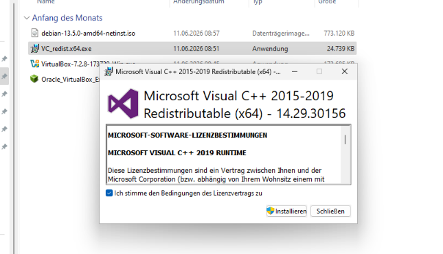
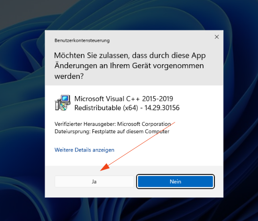
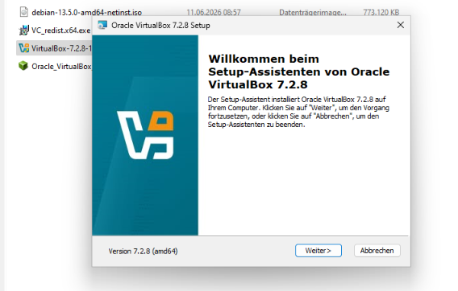

# Virtualbox 

## Installation von Virtualbox unter Windows 11

Voraussetzung ist eine Windows 11 Installation mit Admin-Rechten, um die benötigten Programme installieren zu dürfen. 

Download von Virtualbox bei Oracle - siehe auch:  https://www.virtualbox.org/wiki/Downloads

-> Download [virtualbox-7.2.10](https://download.virtualbox.org/virtualbox/7.2.10/VirtualBox-7.2.10-174163-Win.exe)

Zur Installation ist Visual C++ ggf zusätzlich benötigt. 

-> Donwload [VC_redist.x64.exe](https://aka.ms/vc14/vc_redist.x64.exe)

### Installieren  von Visual C++ 

### Installieren von Virtualbox

## Installation von Debian 13 auf einer virtuellen Maschine (VM)

## Erstellen von Snapshots und Klonen

## Installation eines SVWS-Servers in diese VM 

## Installation eines Wenom-Servers in dieser VM 