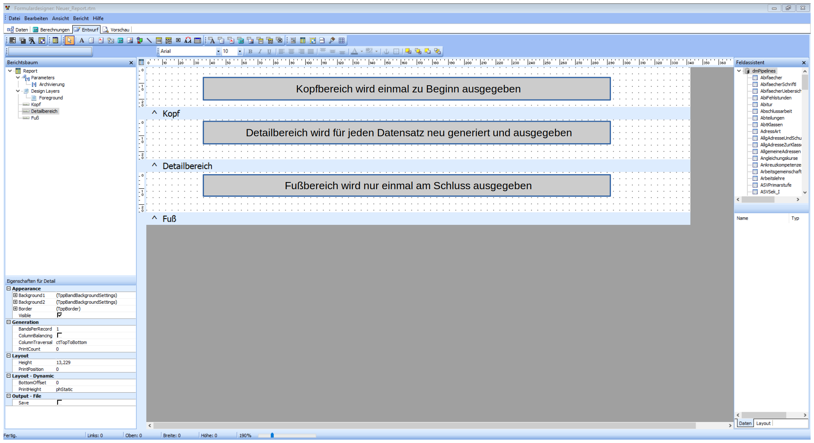

# Report-Schulung zu SchILD

## Vorbemerkungen

Diese Schulungsunterlagen begleiten die Schulung zum Umgang mit dem Formularexplorer. Es wird beschrieben, wie man fremde Reports einbinden kann, vor allem aber, wie man eigene Reports von der Pike auf erstellen kann

## Allgemeine Hilfe

Wie immer gibt es Hilfen im Netz für den Umgang mit SchILD. Hier sind die wichtigsten:

* [https://svws.nrw.de], die Hauptseite für alles, was mit SchILD zu tun hat
* [https://wiki.svws.nrw.de/mediawiki/index.php?title=Hauptseite], die Hilfeseiten mit Wiki
* [https://www.schulministerium.nrw.de/BiPo/fbsuche/fbsuche.xhtml] Fachberatersuche

## Reports

Gehen Sie auf der Website „Schulverwaltung NRW - IT-Anwendungen“ (svws.nrw.de) auf DOWNLOAD - SchILD-NRW - SchILD-Reports - Einzelreports - Alle Schulformen, laden Sie den Report „masernimpfnachweise.rtm“ herunter und entpacken/extrahieren Sie diesen im Ordner „downloads“.
Öffnen Sie über Druckausgabe den Report-Explorer und legen Sie unter dem Ordner „SchILD-Reports“ ein Unterverzeichnis mit beliebigem Namen an. Ziehen Sie jetzt per drag & drop die beiden heruntergeladenen rtm-Dateien in das rechte weiße Feld.

Alternativ können Sie die beiden rtm-Dateien kopieren und unter C:\Users\…\Downloads\ SchILDNRW_Install\SchILDNRW_Install\Schild-Programm\SchILD-Reports ablegen. Dieses Vorgehen ist im Schulbetrieb nur bei lokaler Installation oder Serverinstallation möglich, falls Sie die entsprechenden Zugriffsrechte besitzen. Der Dateipfad lautet dann in der Regel C:\SchILDNRW\SchILD-Reports.

## Schnellzugriff einrichten

Gehen Sie unter Extras - Programm-Einstellungen auf den Reiter Globale Einstellungen - Report-Einstellungen - Schnellzugriff und aktivieren Sie „Schnellzugriff ermöglichen“. Klicken Sie jeweils auf den gelben Ordner und weisen Sie aus dem Verzeichnis „C:\Users\…\Downloads\SchILDNRW_Install\ SchILDNRW_Install\Schild-Programm\SchILD-Reports“ zwei bis drei Reports Ihrer Wahl zu und wählen Sie eine Schalterbeschriftung.

Es erscheint nun sofort und bei jedem Start des Programmes der Report-Schnellzugriff. Sie können nun eine Ihrer erstellten Reportverbindungen anklicken und den Report drucken. Sollten Sie im Container alle Schüler ausgewählt haben ist natürlich die „Ausgabe für … die ganze Gruppe“ nicht zu empfehlen. Schauen Sie sich also lieber nur die Vorschau an.
Oben rechts können Sie den Report-Schnellzugriff schließen und jederzeit mit einem Klick auf "Drucken" wieder öffnen.

## Dokumentenverwaltung einrichten

Gehen Sie unter Extras - Programm-Einstellungen auf den Reiter Globale Einstellungen - Dokumentenverwaltung und aktivieren Sie die Dokumentenverwaltung. Klicken Sie nun unter „Dokumentenverzeichnis“ auf den gelben Ordner und legen einen für Sie passen Pfad fest. Da voreingestellt für alle Schüler der Testdatenbank auf Ihrem Rechner unter C:\ ein Verzeichnis angelegt wird, bietet es sich an, einen Ordner „Dokumentenverwaltung“ in unserem Testprogrammordner anzulegen. Den können Sie später auch einfach wieder löschen.

Klicken Sie nun auf „Dateimaske bearbeiten“ und legen Sie per drag & drop die für Sie passende Verzeichnis- und Dateistruktur der Dokumentenverwaltung an. Alle Merkmale, die Sie nicht benötigen ziehen Sie hierfür in das Kästchen „Merkmale“. Zur Festlegung der Reihenfolge benutzen Sie die roten Pfeiltasten. Bestätigen Sie mit „OK“, klicken Sie auf „Dokumentenverzeichnisse für alle aktiven Schüler anlegen“ und schließen Sie die Programmeinstellungen.
Nun sollte der Reiter oben rechts „Dokumentenverwaltung“ lauten und Sie können einen beliebigen Report in das Dokumentenverzeichnis eines Schülers mit der Einstellung „Ausgabe … nur Archivierung (in Dokumentenverwaltung)“  „Ausgabe für … den ausgewählten Schüler“ drucken, der dort als pdf-Datei hinterlegt wird.

## Oberfläche des Reportdesigners

### Benutzeroberfläche der Reportauswahl

Es folgt eine Übersicht der wichtigsten Bedienelemente des Reportexplorers.

### Die Oberfläche des Reportdesigners

Hier sind die wichtigsten Bedienelemente des Reportdesigners aufgelistet:

Hier finden Sie die wichtigstesn Icons:

| Icon | Bedeutung|
| ----- | -----|
|  | Label (einifaches Textfeld) hinzufügen |
|  | DBText (Datenbankfeld) hinzufügen |
|  | Dynamisch ladbaren Subreport, z. B. Köpfe und Füße, die von mehreren Berichten genutzt werden, hinzufügen. Das Icon befindet sich weit links, bitte nicht mit Subreport verwechseln. |
|  | Subreport zum Zugriff auf eine untergeordnete Datenquelle hinzufügen. Das Icon befindet sich weit rechts, bitte nicht mit dynamsich ladbaren Subreports verwechseln. |
|  | längeren formtierbaren Text (RichText) hinzufügen |
|  | Systemvariable hinzufügen |
|  | Variable hinzufügen |
|  | DBText (Datenbankfeld) hinzufügen |
|  | Graphik hinzufügen |
|  | in der Datenbank hinterlegte Graphik hinzufügen |
|  | Formen hinzufügen |
|  | Seiteneinstellungen ändern |

## Erstellung von Listen

### Ziel

Wir wollen von der Pike auf eine Liste mit Daten über das Lehrerkollegium erstellen. Das Ergebnis soll in etwa so aussehen:

### Allgemeines und Vorarbeit

Die Kopfbereich wird einmal pro Seite ausgegeben, der Fußbereich ebenso. Der Detailbereich wird für jeden Datensatz wiederholt, bis alle Daten angezeigt wurden. Die Elemente der Liste müssen also in den Detailbereich.

Die Elemente der Liste müssen also in den Detailbereich, da hier alle Datensätze „abgearbeitet“ werden. Je nachdem, was für eine Liste ausgegeben werden soll, muss die Datenquelle angepasst werden. Klicken Sie auf „Bericht“ im oberen Menü, dann „Datenquellen“ und das passende auswählen. Da SchILD ein schülerzentriertes Programm ist, ist  die Standarddatenquelle „Schueler“.

Da wir eine Lehrerliste erstellen wollen, müssen wir logischerweise die Datenquelle „Lehrer“ auswählen.

### Kopfzeile und Fußzeile beschriften

Wählen Sie ein DBTextfeld (A-Symbol mit Tabelle im Hintergrund) und klicken in den Kopfbereich des Dokuments. Ziehen Sie das Label möglichst zentriert. Klicken Sie das Feld an und wählen in den beiden Drop-down-menus am linken oberen Rand die Datenquelle "EigeneSchule" und das Datenfeld "Bezeichnung1".

Setzen Sie darunter ein Label(A-Symbol ohne Tabelle im Hintergrund) und klicken Sie unterhalb des DBText-Feldes in den Kopfbereich. Geben Sie in den Bereich oben links "Lehrerliste" ein.