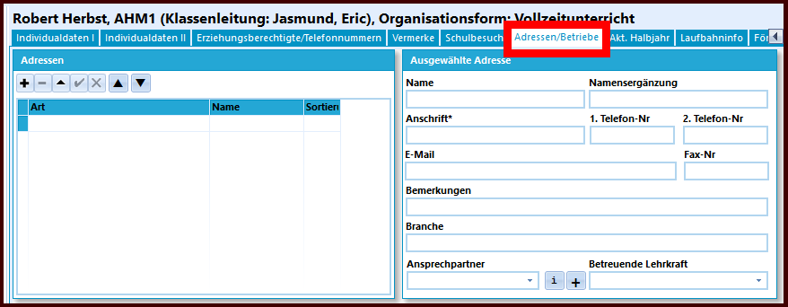

# Hier kommen die SVWS-News der Woche:

Ist dir schon aufgefallen, dass nach der Migration einer BK-Datenbank die **Betriebe bei den Schülern fehlen**?

Genauer: Die Zuordnung der Betriebe zu den Schülern wurde bei der Migration nicht berücksichtigt.

Gemeint ist dieser Reiter:

Schnellstmöglich wurde ein **Bugfix für den SVWS-Server** bereitgestellt, der dieses Problem korrigiert.

Der Bugfix ist mit der aktuellen Schild3-Version kompatibel und steht auf GitHub zur Verfügung:

https://github.com/SVWS-NRW/SVWS-Server/releases

## Warum ist das erst so spät aufgefallen?
+ Die Betriebe werden in der Regel nur von BKs gepflegt
+ Bisher ist uns kein BK bekannt, das produktiv mit Schild3 arbeitet
+ Unsere Schulungsdatenbanken enthalten aufgrund der Anonymisierung keine Betriebe bei den Schülern 