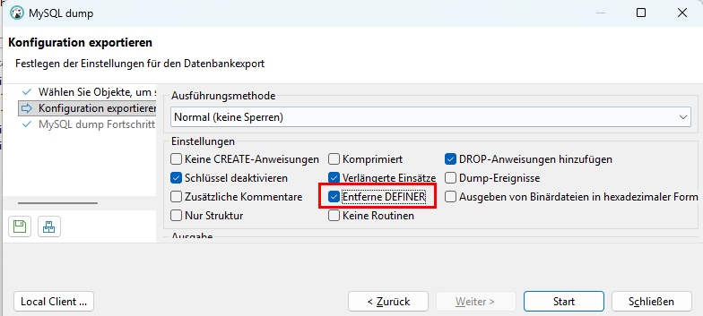
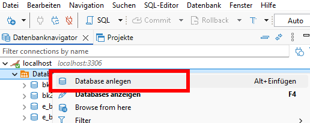
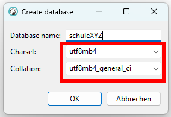
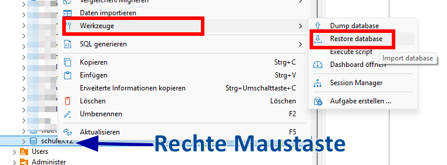
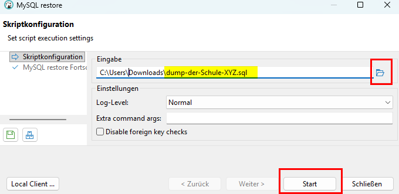
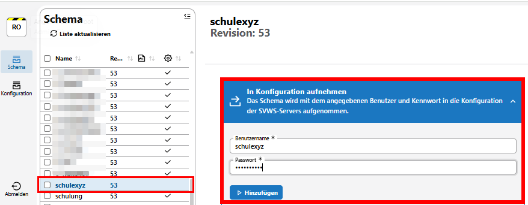

# Hier kommt dein SVWS-Hack der Woche...

### Didacta: 10.04. - 14.04.2026
Wusstest du schon, dass morgen die Didacta startet?    
Wir sind live dabei und präsentieren alles rund um **SVWS-Server, SVWS-Client, WebLuPo, WeNoM, Schild3** und weitere Neuerungen und Infos!   
Kommt gerne vorbei - wir freuen uns auf euch!


Halle: 07.1   
Stand: B040 - C049


Das war diesmal ein kurzer Shortcut der Woche. Alles Weiter ist für interessierte Power-User!


## 🛠️ Für Power-User: sql-Dump importieren mit DBeaver

In der Online-Fortbildung am 03.03.26 wollte ich auf Nachfragen spontan einen Datenbank-Dump-Import mit DBeaver vorführen. Leider kam es nach dem Import zu einem Bug im Client. Das hat mir keine Ruhe gelassen und ich bin auf Ursachensuche gegangen...


**Noch eines Vorweg:**
+ In den allermeisten Support-Fällen ist das Anfordern der Datenbank einer Schule nicht notwendig.
+ Ist es doch einmal sinnvoll, mit mehr Muße in eine Schuldatenbank zu schauen, empfehlen wir dringend, die Schule nach einem SQLite-Backup zu fragen. Der Import wurde bereits im Shortcut der Woche vom 23.02.26 beschrieben.

Daher ist der folgende Import einer Schuldatenbank mit Hilfe eines sql-Dumps nur für interessierte Power-User:

Die Ursache der Fehlermeldung im Client lag an der Erstellung des Dump. Der exportierte sql-Dump beinhaltete den ursprünglichen Datenbankbenutzer. Dadurch konnte das Schema nicht in die Konfigurationsdatei aufgenommen werden.

Folgender Workflow spiegelt meine "Trail and Error" Lösung wieder:


**Lösung 1: Dump ohne Definer erstellen (lassen)**     
| |
|---------------|


**Lösung 2: Definer aus dem Dump entfernen**    
Öffne die sql-Datei mit einem Texteditor (z.B. Notepad++) und entfernen alle Definer-Angaben wie beispielsweise:

```sql
CREATE DEFINER=`schule123`@`%` VIEW ...

wird zu
CREATE  VIEW ...
```

Nun kann der Dump fehlerfrei mit DBeaver erstellt werden und in die Konfigurationsdatei aufgenommen werden

**Schritt 1: Neue Datenbank anlegen:**

| |
|---------------|

Achte auf die UTF-8 Einstellung:    
| |
|---------------|


**Schritt 2: Dump importieren:**    
| |
|---------------|

Importdatei auswählen:    
| |
|---------------|


**Schritt 3: Datenbank-Schema in die Konfiguration aufnehmen**    
Ohne diesen Schritt ist die Datenbank nicht im Browser auswählbar 
| |
|---------------|


**Hinweis:**    
Aufgrund von unterschiedlichen Zeichensätzen beim Erstellen und Einlesen eines Dumps kommt es manchmal beim Importieren zu Fehlermeldungen. Einfacher ist es mit dem SQLite-Format.


:back: [Zurück zu den Tipps der Woche](./../index.md)   