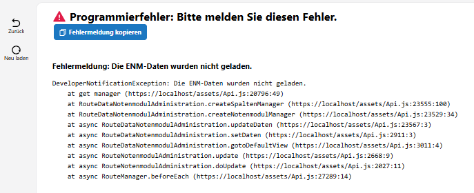
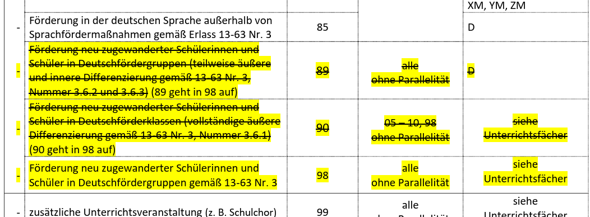
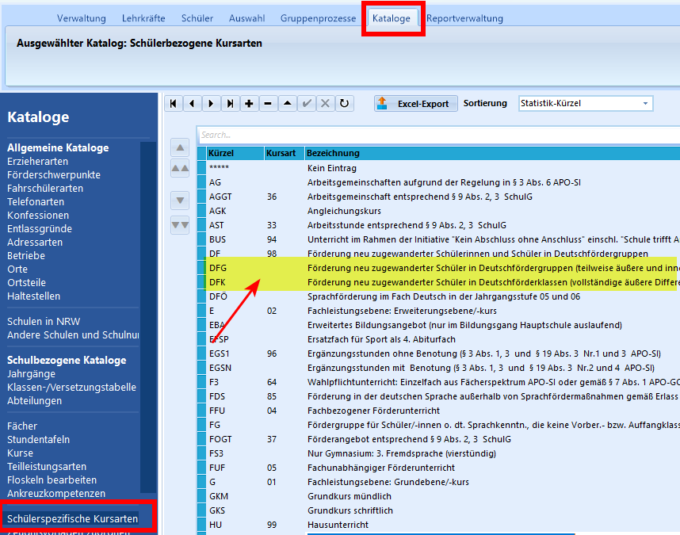
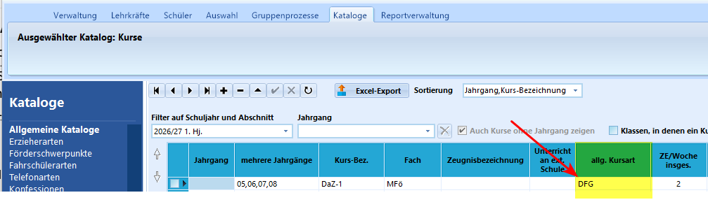
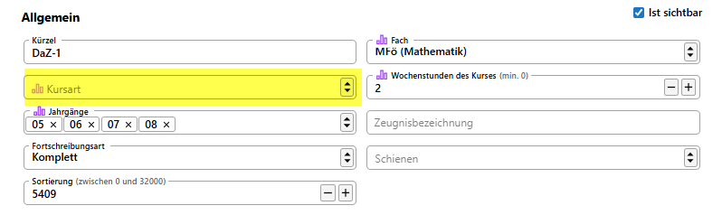
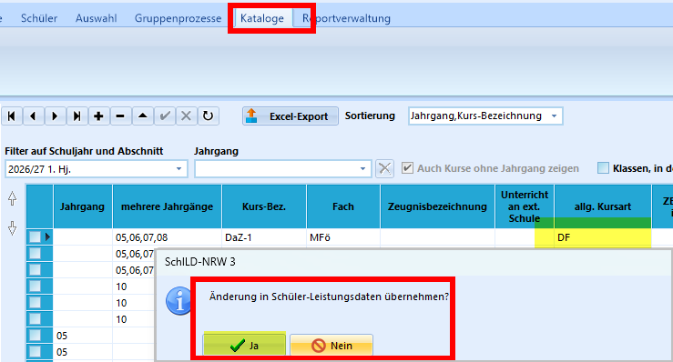

# Hier kommt dein SVWS-Hack der Woche...

Wusstest du schon, dass es die schülerspezifischen Kursarten DFG und DFK seit dem Schuljahresabschnitt 2026.1 nicht mehr gibt und dass es zu Problemen kommt, wenn sie dennoch verwendet werden?

## Kurz und bündig: Das musst du wissen!
Trägt eine Schule dennoch DFG oder DFK als Kursart bei einem Kurs ein, kann dies zu Problemen führen.
Bisher ist bekannt, dass dann beim Klick auf die Notenapp eine Fehlermeldung erscheint. Mit dem kommenden Release wird dies abgefangen. Bis dahin ist es bei dieser Fehlermeldung sinnvoll, einen Blick auf die verwendeten Kursarten zu werfen:

|  |
|---------------|

Außerdem kann es zu großen Wartezeiten beim Aufruf eines Reports kommen.

**Lösung:**     
Die Schule muss die Kursart unter Kataloge/Kurse anpassen und diese Änderung für die Schüler-Leistungsdaten übernehmen.

## Etwas ausführlicher: Wieso, Weshalb, Warum - Zum Weiterleiten an betroffene Schulen

Die Kursarten DFG und DFK wurden mit Beginn des Schuljahres 2026/27 abgeschafft, wie den Schlüsseltabellen von IT-NRW zu entnehmen ist:

|  |
|---------------|

In Schild3 stehen DFG und DFK allerdings weiterhin im Katalog zur Verfügung, sofern diese früher einmal angelegt wurden. 

Öffnet man den Katalog "schülerspezifische Kursarten", ist zu erkennen, dass für diese Kursarten kein Schlüssel mehr hinterlegt ist:    
|  |
|---------------|

In SchILD3 kann trotzdem weiterhin ohne Fehlermeldung ein Kurs mit Kursart DFG bzw DFK anlegt und anschließend den Schülern zuwiesen werden:
|  |
|---------------|

Betrachtet man den Kurs mit der fehlerhaften Kursart im Client, so ist dort ein leeres Feld:     
|  |
|---------------|

**Lösung:**    
Die Kursart im Schülerkatalog anpassen und die Änderung für die Schüler-Leistungsdaten übernehmen:

|  |
|---------------|

:back: [Zurück zu den Tipps der Woche](./../index.md)   