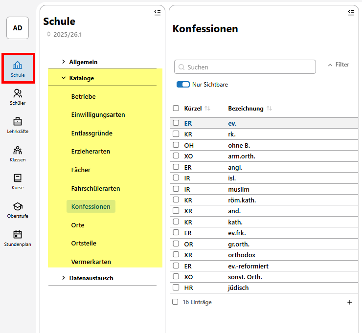
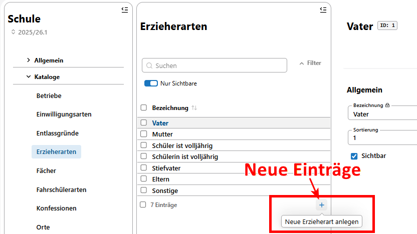
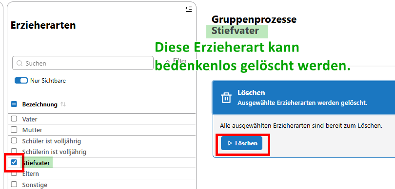
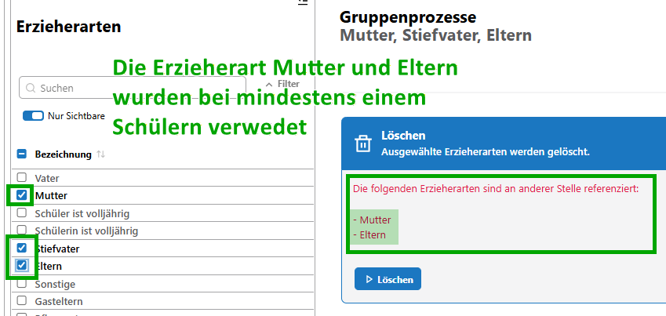
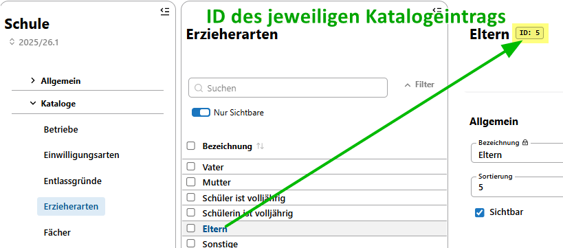

# Hier kommt dein SVWS-Hack der Woche...

Hier kommt dein SVWS-Hack der Woche:

Wusstest du schon, dass nun auch viele Kataloge im SVWS-Client vorhanden sind?

Im SVWS-Release v1.2.1 vom 30.01.2026 wurden für den Produktivbetrieb zusätzliche Kataloge im Reiter „Schule“ freigeschaltet:

|  |
|---------------|

### Infos zu den Katalogen im Client:

+ Die Liste der Kataloge im Client ist nicht vollständig. Weitere Kataloge werden mit den nächsten Updates folgen.
+ Ob du einen Katalogeintrag im Client oder in Schild3 änderst oder ergänzst, spielt keine Rolle.
+ Über das "+" Zeichen können Katalogeinträge hinzugefügt werden

  | |
  |---------------| 

+ Wenn du einen oder mehrere Häkchen setzt, können einzelne Einträge gelöscht werden.    
    Das Löschen der Erzieherart Stiefvater hat keine weiteren Auswirkungen:

  | |
  |---------------|

  Beim Löschen der Erzieherarten „Mutter“ oder „Eltern“ erscheint ein Hinweis, da diese Erzieherarten bei mindestens einem Erzieher hinterlegt sind:    
Klare Empfehlung: Diese Einträge nicht ohne Weiteres löschen! 

  | |
  |---------------|

### 🛠️ Für Power-User: Arbeiten mit der ID

Für die Profis unter euch gibt’s noch einen tieferen Einblick:    
Ihr könnt im Client die ID eines Eintrags sehen. Über diese ID lassen sich in der Datenbank alle Einträge finden, die auf die jeweilige Erzieherart verweisen.

Das ist besonders hilfreich, wenn ein Eintrag gelöscht werden soll, der an anderer Stelle in der Datenbank noch verwendet wird.

| |
|---------------|

:back: [Zurück zu den Tipps der Woche](./../index.md)   