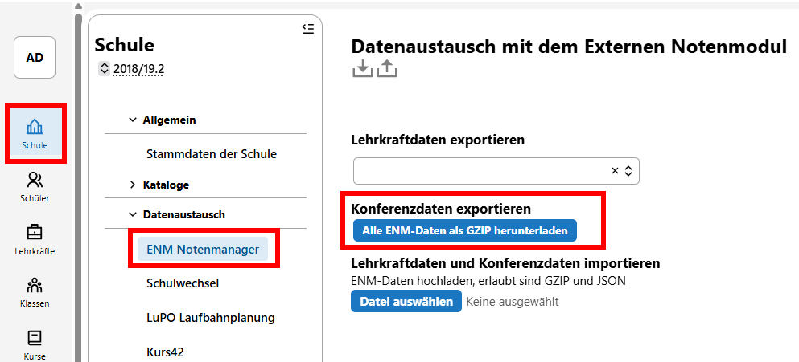
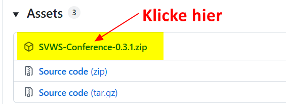
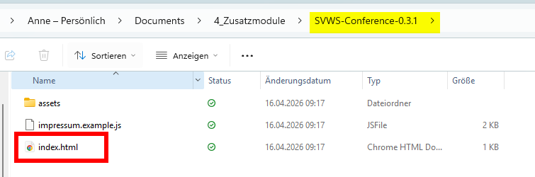
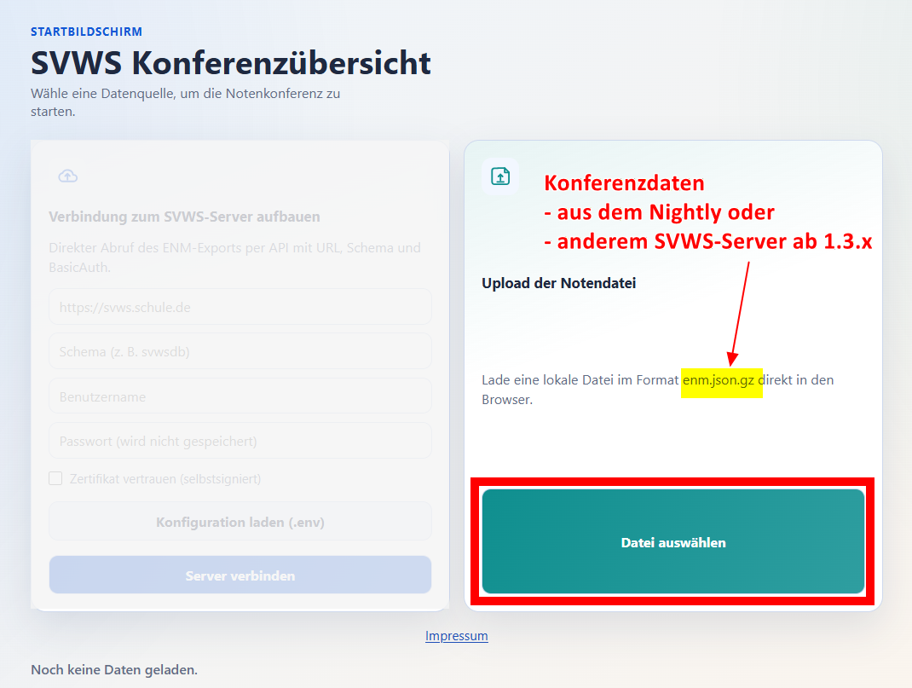

# Hier kommt dein SVWS-Hack der Woche...

Wusstest du schon, dass es jetzt eine **SVWS-Konferenzübersicht für den SVWS-Server** gibt?

Der sehnliche und definitiv nachvollziehbare Wunsch etlicher Schulen ist nun in Erfüllung gegangen. Für Schild-NRW3 und den SVWS-Server wurde eine Konferenzübersicht entwickelt, welche bereits voll einsatzfähig ist.

## Alle Infos in Kürze
+ Download: Über die Homepage: https://www.svws.nrw.de/ (voraussichtlich Ende April)
+ Aktuelle Version: Release 0.3.1
+ Kompatible SVWS-Version: Ab SVWS-Release v1.3.0 (Ende April 2026)
+ Anleitung: https://doku.svws-nrw.de/svws_module/svws_konferenzuebersicht/

## So kannst du auch jetzt schon testen
Wenn ihr das SVWS-Release 1.3.0 nicht abwarten wollt, könnt ihr mit dem SVWS-Server vom MSB (dem sog. nightly) testen. Dazu hier eine Kurzanleitung:

**Schritt 1: Konferenzdaten aus dem SVWS-Server holen**    
Unter Schule/Datenaustausch kannst du die Konferenzdaten exportieren:
|  |
|---------------|

Hinweis:     
Die exportierte Konferenzdatei heißt enm.json.gz und befindet sich vermutlich in deinem Download-Ordner. 
Du musst die Datei nicht entpacken!

**Schritt 2: Download von SVWS-Conference**    
Speichere und entpacke die Datei SVWS-Conference-0.3.1.zip von der Downloadseite.
|  |
|---------------|     

**Schritt 3: SVWS-Konferenzansicht starten**    
Starte die Konferenzansicht mit Doppelklick auf index.html:
|  |
|---------------|

**Schritt 4: Konferenzdatei öffnen**    
Öffne die in Schritt 1 exportierte Datei enm.json.gz:
|  |
|---------------|

## Wann ist die offizielle Veröffentlichung?
Mit dem kommenden SVWS-Release Ende April kann die SVWS-Konferenzansicht auch in Schulen eingesetzt werden. Die zip-Datei steht den Schulen dann auf der Homepage zum Download bereit. 

## Grenzen der SVWS-Konferenzansicht
Es sind nur Leistungsdaten des aktuellen Abschnittes sichtbar.

:back: [Zurück zu den Tipps der Woche](./../index.md)   