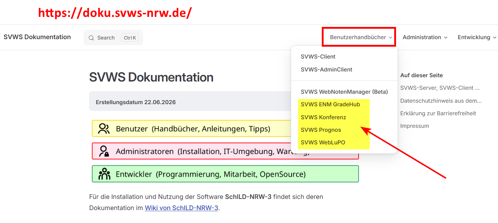

# Hier kommt dein SVWS-Hack der Woche...

Wusstest du schon, dass es inzwischen **vier Tools rund um den SVWS-Server** gibt?

## Übersicht und Download
+ SVWS-GradeHub (Notenmodul)    
     -> Download hier: https://github.com/SVWS-NRW/SVWS-GradeHub/releases
+ SVWS-Conference    
    -> Download hier: https://github.com/SVWS-NRW/SVWS-Conference/releases
+ SVWS-Import    
    -> Download hier: https://github.com/SVWS-NRW/SVWS-Import/releases
+ SVWS-Prognos    
    -> Download hier: https://github.com/SVWS-NRW/SVWS-Prognos/releases

## Anleitungen
An den Anleitungen wird aktuell noch gearbeitet. Erste Fassungen findest du bereits auf der SVWS-Doku-Seite unter den Benutzerhandbüchern:

https://doku.svws-nrw.de/

|  |
|---------------|

## Feature-Wünsche
Die Tools wurden von Frank entwickelt. Über konstruktives Feedback freuen wir uns natürlich sehr. Bitte habt aber Verständnis dafür, dass aktuell nur begrenzt Kapazitäten für die Umsetzung weiterer Feature-Wünsche vorhanden sind. Fehlerkorrekturen, sowie notwendige Erweiterungen werden nach Möglichkeit umgesetzt, sobald die entsprechenden Zeitressourcen zur Verfügung stehen.

:back: [Zurück zu den Tipps der Woche](./../index.md)   