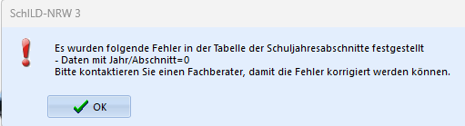
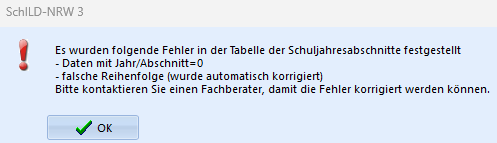
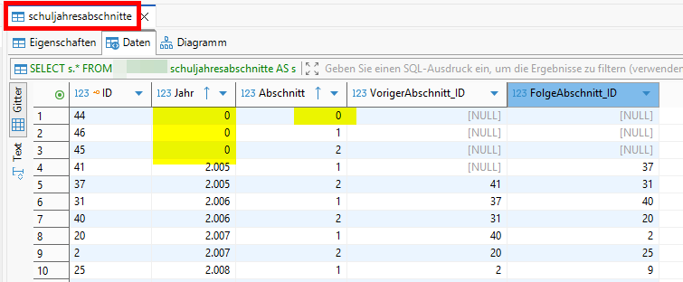
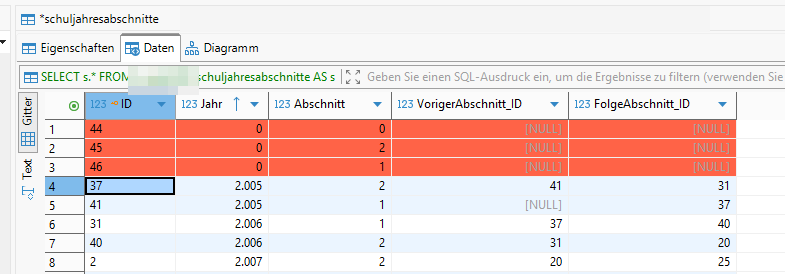

# Hier kommt dein SchILD-Tipp der Woche...

Wusstest du schon, dass einige Schulen nach dem Programmstart von SchILD3 einen Warnhinweis bekommen?

So sieht die Warnung aus:

|   |
|---------------|

Manchmal stellt Schild3 auch zusätzlich eine falsch Reihenfolge fest und korrigiert diese. 
|   |
|---------------|

## Das wichtigste vorweg:
+ Wenn sich eine Schule mit dieser Warnung bei dir meldet und du nicht sicher bist, was du tun sollst, dann leite die Anfrage an unser Support-Team weiter und wir lösen das gemeinsam.
+ Wenn sich ein IT-Dienstleister bei dir meldet, dann kannst du ihn direkt an unser Support-Team verweisen.
+ Ich zeige den Umgang mit dieser Warnmeldung sowohl in der Onlinefortbildung "Datenbanken sichten mit DBeaver" am kommenden Dienstag als auch in der Fortbildung "Support für Schulen - Infos für Fachberater" am 23.04.26.

## Was bedeutet diese Warnung?
In der Datenbank gibt es die Tabelle Schuljahresabschnitte. Diese Tabelle gibt es in Schild2 nicht. 

Bei der Migration wird die gesamte Schild2 Datenbank nach Hinweisen zu Schuljahresabschnitten durchsucht. Basierend auf diesen Infos, wird die Tabelle Schuljahresabschnitte in Schild3 gefüllt.

Manchmal kommt es vor, dass in der Schild3 Datenbank 0-Eintäge in der Tabelle Schuljahresabschnitte stehen. Wenn man direkt in die Datenbank schaut, sieht das so aus:

|   |
|---------------|

Wo diese Nullen aus Schild2 herkommen, kann man nur schwer herausfinden. 

## Was muss ich tun?
Kurz gesagt:   
**Diese Einträge müssen gelöscht werden, damit die Warnmeldung beim Schild3-Start verschwindet.**

Du kannst die Einträge beispielsweise mit dem Datenbanktool DBeaver löschen. Dazu markierst du die Zeilen und drückst dann die Entfernen-Taste.

Die Zeilen werden dann erstmal rot. Nach dem Speichern sind sie weg.

|   |
|---------------|

:back: [Zurück zu den Tipps der Woche](./../index.md)   

