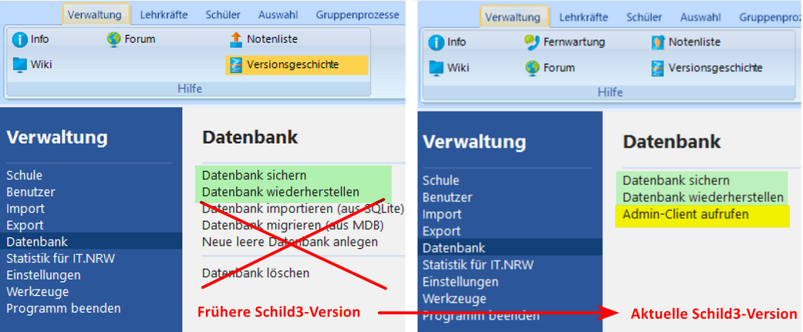
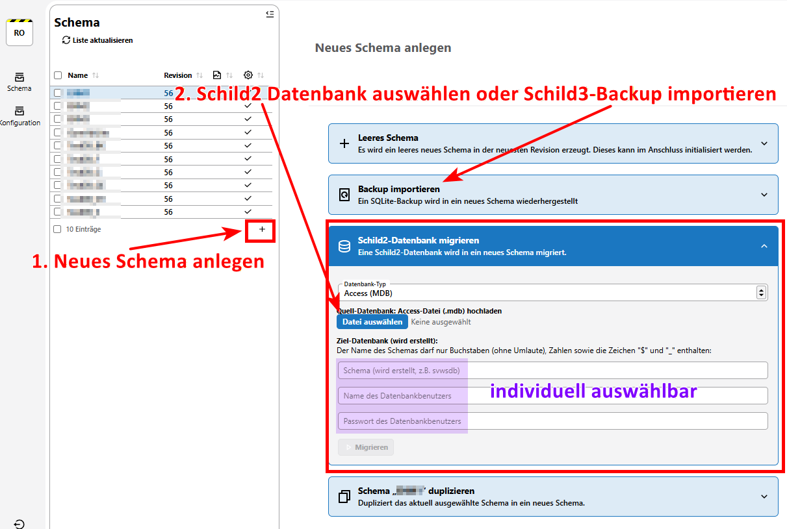

# Hier kommt dein SchILD-Tipp der Woche...

Wusstest du schon, dass die **Datenbankmigration nicht mehr direkt über SchILD3** angestoßen werden kann?

In der Schild3-Version 3.3.0 wurden folgende Datenbankoptionen entfernt:
+ Datenbank importieren
+ Datenbank migrieren
+ Leer Datenbank anlegen
+ Datenbank löschen 

Stattdessen besteht nun die Möglichkeit, den Admin-Client über SchILD3 aufzurufen:
|   |
|---------------|

### Wie migriere oder importiere ich nun am einfachsten eine Datenbank? 

Ganz einfach: über den Admin-Client.    

Die Migration konnte auch bisher schon über den Admin-Client durchgeführt werden – am gewohnten Workflow hat sich also nichts geändert:
|   |
|---------------|

:back: [Zurück zu den Tipps der Woche](./../index.md)   

