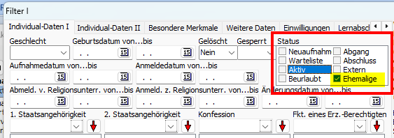
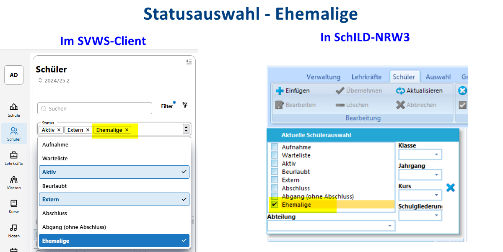
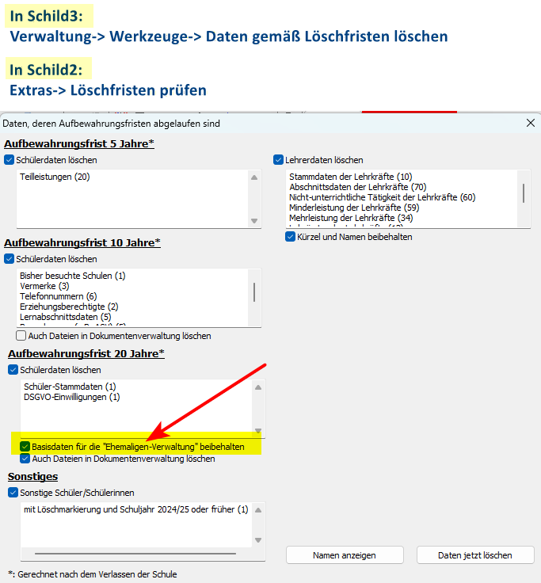

# Hier kommt dein SchILD-Tipp der Woche...

Wusstest du schon, dass es einen **Status Ehemalige** bei den Schülern gibt? 

Und jetzt kommt’s: Bei manchen Schulen befinden sich nach der Migration sogar Schüler in der Auswahl „Ehemalige“. 🤔

Der Status "Ehemalige" ist nämlich gar nicht neu. Er ist aber bei SchILD2 ein wenig versteckt. Man findet ihn dort nur beim Filter I als Auswahlkriterium:

|   |
|---------------|

In SchILD3 und im SVWS-Client kann man ehemalige Schüler auch direkt im Schnellfilter auswählen:

|   |
|---------------|

### Was ist der Unterschied zwischen Abschluss und Ehemalige?
Bei ehemaligen Schülern sind nur noch Adressdaten hinterlegt, da die 20 jährige Aufbewahrungsfrist abgelaufen ist. Die Schulen müssen bei der Speicherung der Ehemaligen-Infos die VO-DV I und II berücksichtigen.

### Wie bekommt ein Schüler den Status "Ehemalige"?

Beim Prüfen der Löschfristen gibt es die Option, die Basisdaten für die Ehemaligen-Verwaltung beizubehalten:

|   |
|---------------|

:back: [Zurück zu den Tipps der Woche](./../index.md)   

