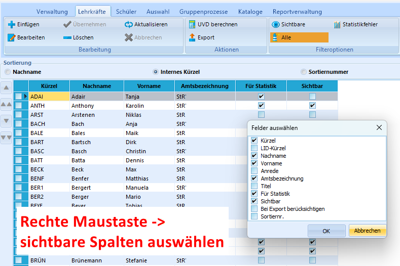
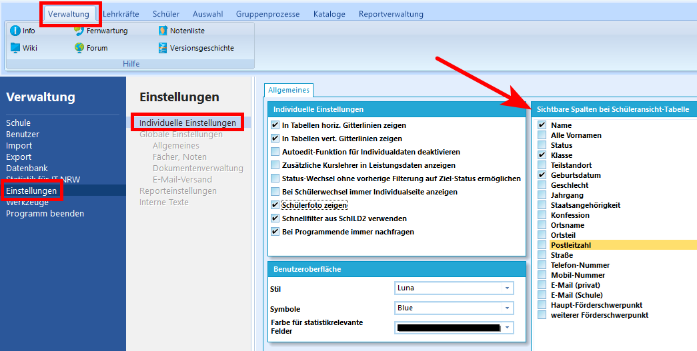

# Hier kommt dein SchILD-Tipp der Woche...

Wusstest du schon, dass man in SchILD3 seit dem letzten Update auch bei den Lehrkräften sichtbare Spalten hinzufügen kann?

Das funktioniert genauso wie bei der Sichtbarkeit der Schülerspalten in SchILD2:    
Einfach mit der rechten Maustaste auf den Lehrercontainer und die Option "sichtbare Spalten auswählen" klicken. 

|   |
|---------------|

### Aber Vorsicht!
Dabei handelt es sich um eine globale Programmeinstellung. Wenn ein Benutzer mit entsprechenden Rechten die Spaltenanzeige bei den Lehrkräften ändert, wirkt sich dies auch auf die Ansicht anderer Benutzer aus – sofern diese mit derselben SchILD3-Installation arbeiten.

### Spaltenauswahl bei den Schülern
Die Auswahl der sichtbaren Spalten im Schülercontainer ist übrigens in SchILD3 nun anders als noch in SchILD2. Jeder Benutzer kann nun individuell unter Verwaltung/Einstellungen die sichtbaren Spalten auswählen:

|   |
|---------------|

:back: [Zurück zu den Tipps der Woche](./../index.md)   

