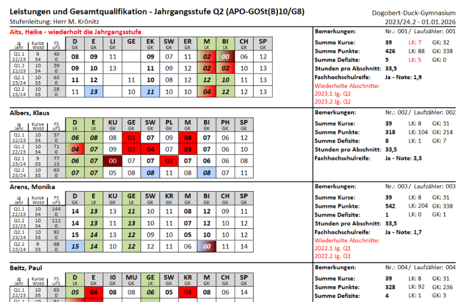
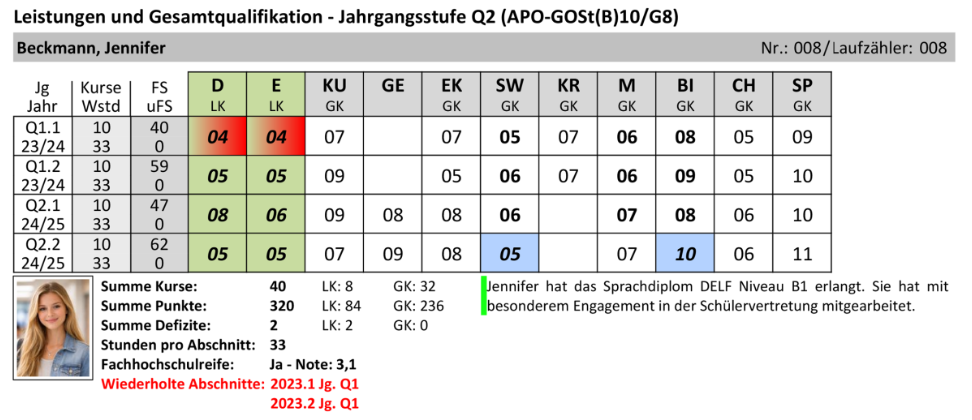
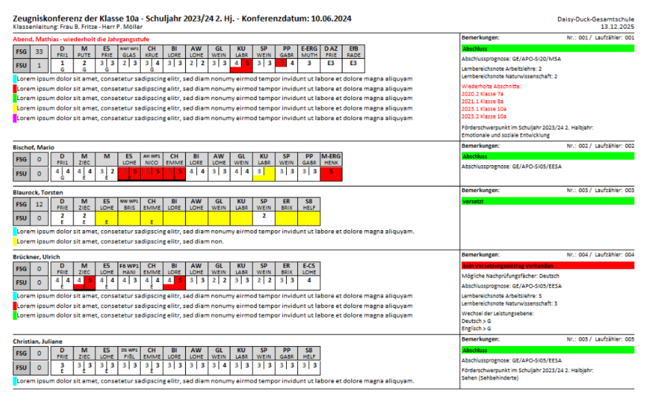

# Hier kommt dein SchILDtipp der Woche...

Wusstest du schon, dass es jetzt auch Übersichten für Leistungsdaten aller Jahrgangsstufen gibt?

Und zwar nicht nur als normale Notenübersicht, sondern auch speziell für Konferenzen!

**Download (sind in der Basissammlung):**    
https://github.com/SVWS-NRW/Schild-NRW-3-Reports/releases

**Anleitung:**    
https://schulverwaltungsinfos.nrw.de/svws/wiki/index.php?title=Basisreports_%26_Downloads_Themen%C3%BCbersicht#Leistungs%C3%BCbersichten_&_Bescheinigungen

### Hier mal ein Beispiel  für die Q2:
  

### Oder als Einzelansicht:
  

### Auch für die Sek-I und für die Grundschule gibt es Übersichten:
  

:back: [Zurück zu den Tipps der Woche](./../index.md)   