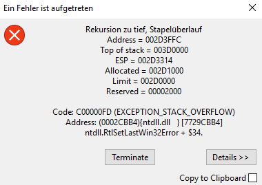

# Hier kommt dein SchILD-Tipp der Woche...

Wusstest du schon, dass beim Anstoßen der Statistikprüfung in Schild3 oft die Fehlermeldung **"Rekursion zu tief, Stapelüberlauf"** erscheint?

Konkret öffnet sich dieses Fehlerfenster nach dem Aufruf unter Verwaltung → Statistik für IT.NRW → Gesamtprüfung der Daten:

|   |
|---------------|

### Warum ist das so?

Wenn eine Schule zum ersten Mal mit SchILD3 die Statistikprüfung durchführt, wird im SVWS-Arbeitsverzeichnis automatisch der Unterordner „Statistik“ angelegt. In diesen Ordner werden Dateien kopiert, ausgelesen und gespeichert. Beispielsweise liegt hier nach der Prüfung auch das Fehlerprotokoll.

Dafür benötigen sowohl der Benutzer als auch das System selbst Lese-, Schreib- und Änderungsrechte.

### Was rate ich den Schulen?
Am einfachsten ist es, den Ordner "Statistik" manuell im SVWS-Arbeitsverzeichnis anzulegen. Anschließend sollten die Berechtigungen des Ordners und der übergeordneten Ordner überprüft werden, da die Berechtigungen ggf. von diesen übernommen werden. Sowohl der Benutzer als auch das System müssen über Lese-, Schreib- und Änderungsrechte verfügen.

### Hinweis
Für die erstmalige Statistikprüfung mit Schild3 müssen die .dll-Dateien neu registriert werden, da diese sonst für die Prüfroutine nicht gefunden werden. Das funktioniert genauso wie in Schild2: 
https://schulverwaltungsinfos.nrw.de/svws/forum/viewtopic.php?f=26&t=17

:back: [Zurück zu den Tipps der Woche](./../index.md)   

