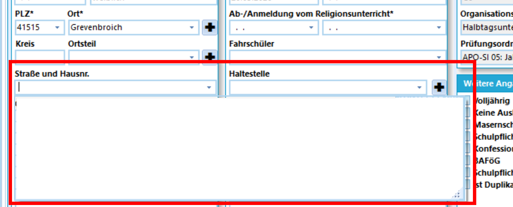
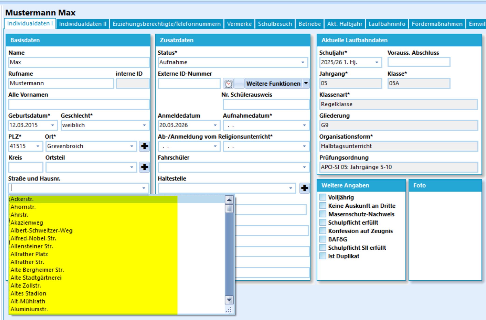
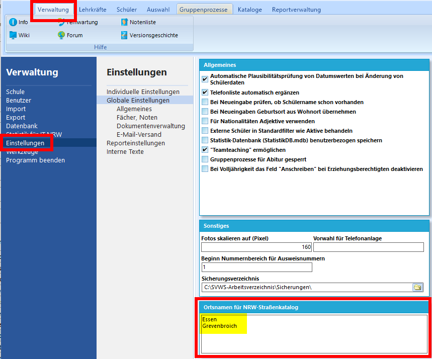
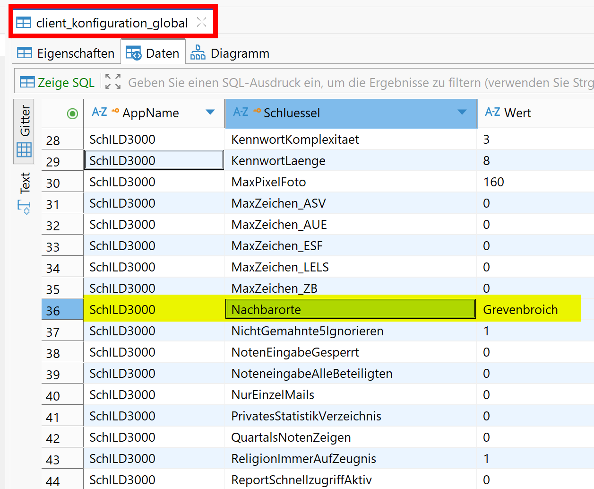

# Hier kommt dein SchILD-Tipp der Woche...

Wusstest du schon, dass man in SchILD3 einen Straßenkatalog laden kann? 

Bei den Individualdaten der Schüler ist das Drop-Down-Menu im Straßenfeld zunächst leer. 
Der Straßenname muss manuell eingegeben werden:     
|   |
|---------------|

Bei entsprechender Einstellung können Straßen eines bestimmten Ortes im Drop-Down-Menu ausgewählt werden:     
|   |
|---------------|

## Wo finde ich die Einstellung und welche Straßennamen sollen geladen werden?

In den Einstellungen kann man einen oder auch mehrere Orte hinterlegen. Nach einem Neustart von SchILD3 können die Straßen dieser Orte im Straßenfeld der Schüler über das Drop-Down-Menu ausgewählt werden. Eine manuelle Eingabe ist weiterhin möglich.

|   |
|---------------|

## 🛠️ Für Power-User: Eintrag in der Datenbank

Die Einstellungen findet man in der Datenbank in der Tabelle client_konfiguration_global:    
|   |
|---------------|

:back: [Zurück zu den Tipps der Woche](./../index.md)   

