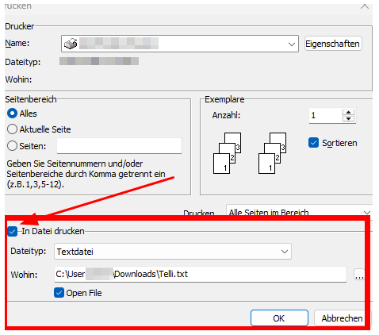
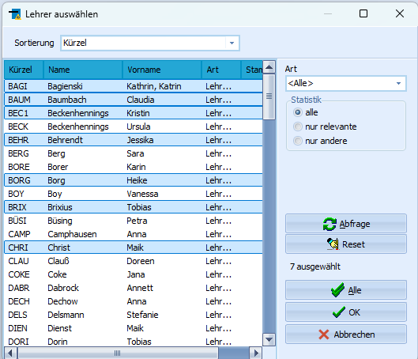
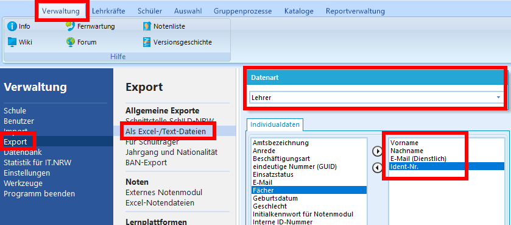

# Hier kommt dein SchILD-Tipp der Woche...
Wusstest du schon, dass es eine KI gibt, für deren Nutzung ein **Export der Lehrerdaten aus SchILD** empfohlen wird?

Die KI, von der hier die Rede ist, heißt telli. Telli ist ein für den Bildungskontext optimierter KI-Chatbot, den Lehrkräfte für die Unterrichtsvorbereitung- und gestaltung nutzen können. Zur Nutzung müssen die Lehrkräfte im Telli-System angemeldet werden. In der "Telli-Anleitung" wird der Import der Lehrkräfte über eine in SchILD generierte XML-Datei (Logineo NRW Export-Funktion) empfohlen. 

### Export über die SchILD-Logineo-Schnittstelle
Die Entwickler von Telli haben eine Anleitung für den Schild-Export bereitgestellt. Für SchILD3 lässt sich die Anleitung 1:1 übertragen:
+ https://nrw.telli.schule/Hinweise-zur-Vorbereitung-der-Importdateien.pdf

## Welche Probleme können in SchILD auftreten?
Die folgenden Lösungsvorschläge basieren auf dem Austausch mit anderen Schulen, da mir selbst kein Zugang zu Telli zur Verfügung steht.

### - Fehlende IdentNr - 
Möchte eine Schule die Lehrerdaten über SchILD exportieren, so muss die IdentNr in Schild vorliegen. Auch hierzu gibt es eine detaillierte Anleitung, was zu tun ist, wenn die IdentNr nicht eingetragen und vermeintlich unbekannt ist:
+ https://nrw.telli.schule/Fehlende-Lehrer-Identnummern-in-SchILD.pdf

### - Beim Export wird die private Mailadresse der Lehrkräfte exportiert - 
Dieses Problem betrifft nur die SchILD2-Logineo-Schnittstelle. In SchILD3 (Bugfix 3.1.1) wurde der Logineo-Lehrerexport korrigiert, sodass die dienstliche Mailadresse der Lehrkräfte berücksichtigt wird.

**Lösung für Schild2 mit einem Report**    
Die Schulen können für Schild2 den angehängten Report nutzen, um eine csv-Datei zu erzeugen. Nach dem Öffnen muss die Ausgabe in eine Textdatei geschrieben werden. Anschließend muss die Endung .txt in .csv umbenannt werden:

|   |
|---------------|

Hinweis      
Das Öffnen der csv-Datei mit Excel könnte das Format ändern. Ich empfehle, die Datei über die rechte Maustaste mit dem Editor zu öffnen.

### - Export nur für ausgewählte Lehrkräfte -
Es kam die Nachfrage, ob man eine csv-Datei nur für ausgewählt Lehrkräfte erzeugen kann.
Dazu kann ebenfalls der Report genutzt werden.
Nach dem Öffnen können hier einzelne Lehrkräfte ausgewählt werden:     
|   |
|---------------|

### - Alternative Exportfunktion - 
Der Export kann in SchILD3 auch über den Excel-Export generiert werden:
|   |
|---------------|

:back: [Zurück zu den Tipps der Woche](./../index.md)   

