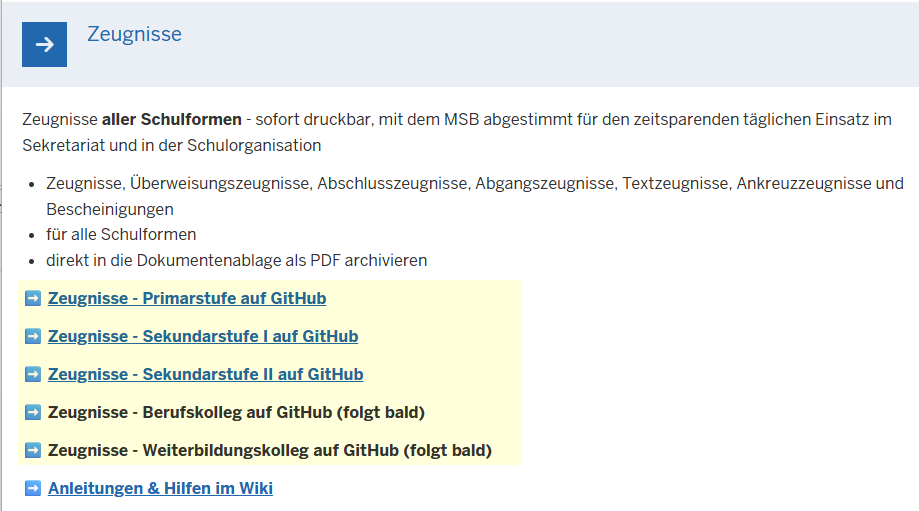
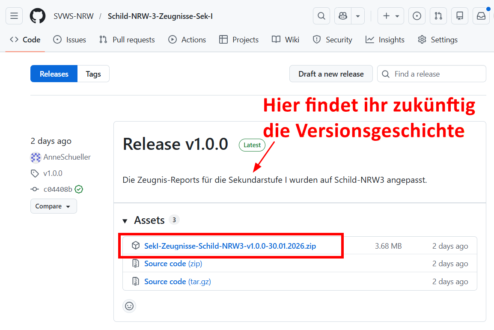

# Hier kommt dein SchILD-Tipp der Woche...

Wusstest du schon, dass die **Zeugnisreports für Schild3 im Github** bereitstehen?

Der Download der Zeugnisse ist - anders als bei Schild2 - nur über Github möglich. Auf der Homepage findet ihr hier die entsprechenden Download-Links.

[Die Verlinkung zu Github findet ihr auf der Homepage](https://www.svws.nrw.de/svws-server-schild-nrw-3/reports-zeugnisse-fuer-schild-nrw-3-als-download)

|   |
|---------------|

Über den Link kommt ihr direkt zum passenden Zeugnispaket.    
Nach einem Klick auf die zip-Datei, findet ihr diese im Download-Ordner. Ein Account ist dazu nicht notwendig.

|   |
|---------------|

**Hinweis zu den BK-Zeugnissen**    
An dem vollständigen Schild3-Zeugnis-Release wird derzeit noch gearbeitet. Nutzt solange die Reports von dieser Seite für den Zeugnisdruck. Dort findet ihr auch bereits gesonderte Schild3-Zeugnisse für Anlage D.
http://github.com/SVWS-NRW/Schild-NRW-BK-Zeugnisse/releases/tag/v1.0.75

:back: [Zurück zu den Tipps der Woche](./../index.md)   

