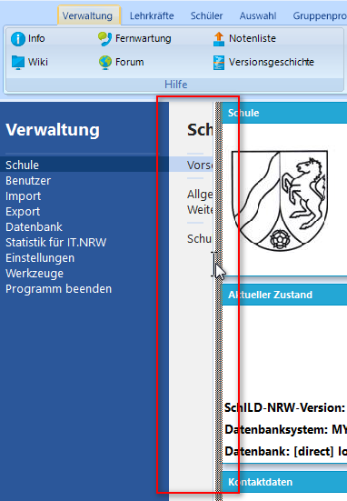

# Schild-NRW3 - Layout

## Öffnen von SchILD-NRW3 
Wie gewohnt starten Sie SchILD mit einem Doppelklick auf das Programmsymbol. Beim Start landet man automatisch im Reiter Schüler:

  

Beim genauen Betrachten stellt man schnell fest, dass vieles gleich geblieben ist zu SchILD2:
* Links befindet sich der gewohnte Schülercontainer
* Oberhalb vom Schülercontainer kann nach Klassen, Jahrgängen usw. gefiltert werden. Neu ist die Auswahl von Abteilungen.
*  Zentral werden die Individualdaten I dargestellt.
* Die aktuellen Laufbahndaten sind ebenfalls einsehbar. Allerdings nun auf der rechten Seite, anstatt wie in SchILD2 unterhalb der Individualdaten.
* Die Tabs für einen einzelnen Schüler sind überwiegend gleich geblieben:
  
Ein Tab Vermerke ist dazugekommen. Da kommen wir aber später nochmal zu.

### Aufgaben
* Filtern Sie die Klasse 6a.
* Heben Sie den Filter auf und filtern Sie den Jahrgang 7
* Klicken Sie den Schülerreiter für einen Schüler einmal durch, um mit der Oberfläche vertraut zu werden. 
* Ändern Sie bei einem Schüler die Mailadresse. Beachten Sie den unten stehenden Hinweis.
* Ändern Sie die Übergangsempfehlung eines Kindes aus der 5a.
* Tragen Sie bei einem Schüler einen Vermerk "Beurlaubt am 17.3.24" ein.
* Bei einem Schüler aus der 7b wurde vergessen, den Migrationshintergrund einzutragen. Er wurde zwar in Deutschland geboren, aber seine Mutter kommt aus Ghana.

Weitere Arbeitsprozesse wie beispielsweise Filtern, Gruppenprozesse, Listenausdrucke oder wichtige Importe/Exporte folgen später.

> [!NOTE]
> Nach dem Bearbeiten von Schülerdaten muss man die Eingaben über den "Übernehmen"-Button bestätigen:
  

### Spalteneinstellung
Beim Durchklicken stellt man an manchen Stellen fest, dass die Spaltenbreite nicht immer für den aktuell verwendeten Bildschirm optimal sind. Diese sollte man sich durch Ziehen mit der linken Maustaste anpassen. Die Einstellungen bleiben auch bei Updates gespeichert. Je nach Monitoreinstellung kann es auch in ganz seltenen Fällen vorkommen, dass eine Spalte fast ganz verdeckt ist. 

 

 
