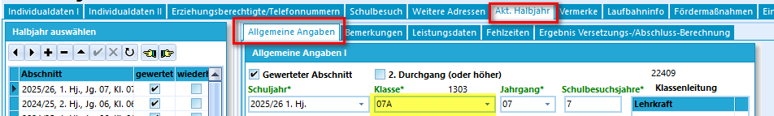

# Anpassungen bei den Schülerdaten
Die meisten Anpassungen und Arbeitsschritte können sowohl in der Desktop-Anwendung SchILD-NRW3 (Im folgenden kurz schild3) als auch in der Browser-Variante (im folgenden kurz SVWS-Client) vorgenommen werden. Da der SVWS-Client stetig weiterentwickelt wird und immer mehr Funktionalitäten dort implementiert werden, empfehle ich, überwiegend mit dem SVWS-Client zu arbeiten. 

## Statistik-relavante Felder

In Schild3 sind bei den Individualdaten I und II die zu erfassenden Daten überwiegend identisch zu den Daten in schild2. Die Anordnung wurde ein wenig angepasst und das Schülerfoto ist nun unter Individualdaten I stets sichtbar, sofern ein Bild hinterlegt ist und die Sichtbarkeit eingestellt ist. Das Sternchen an den Überschriften signalisiert die Relevanz für die Statistik. Dies ist auf den ersten Blick etwas unscheinbar.

### :a: Aufgabe - Farbe der Statistikfelder anpassen
Ändern Sie die Farbe für statistikrelevante Felder auf grün. 
::: details
1. Wechseln Sie in den Reiter "Verwaltung" und wählen Sie "Einstellungen/Individuelle Einstellungen" aus
2. Ändern Sie die Farbe für statistikrelevante Felder wie gewünscht:
     
:::

## Aktuelles Halbjahr
Bisher konnten die Laufbahndaten sowohl unter Individualdaten I als auch im aktuellen Halbjahr geändert werden. Nun sind unter Individualdaten I die Felder der Laufbahndaten ausgegraut. Änderungen sind nun nur noch im aktuellen Halbjahr möglich. Analog findet man graue Felder bezüglich der Förderschwerpunkte unter Individualdaten II. Da sich diese Angaben immer nur auf den aktuellen Abschnitt beziehen, sind Änderungen diesbezüglich nur noch im aktuellen Halbjahr möglich.
### :a: Aufgabe - Klassenwechsel eines Schülers
Ein Schüler wechelt von der 7a in die 7b. Nehmen Sie notwendige Änderungen vor.

::: details
1. Wechseln Sie in den Reiter Aktuelles Halbjahr / Allgemeine Angaben:
    
2. Ändern Sie die Klasse auf 7b. 
3. Passen Sie die Fächer in den Leistungsdaten an. Hier hat sich nichts geändert im Vergleich zu schild2. Hilfe finden Sie hier: https://schulverwaltungsinfos.nrw.de/svws/wiki/index.php?title=Leistungsdaten_(Aktuelles_Halbjahr_/_Aktueller_Abschnitt
:::

### :a: Aufgabe - Eintragen des Förderschwerpunkt 
Ein Schüler aus der 5a hat eine Sehbehinderung. Hinterlegen Sie den entsprechenden Förderschwerpunkt in schild3
::: details
Auch diese Angaben werden im aktuellen Halbjahr / Allgemeine Angaben gesetzt.
:::

## Kataloge - Klassen-/ Versetzungstabelle
Unter dem aktuellen Halbjahr findet man auch den derzeitigen Klassenlehrer des Schülers. Hier gibt es keine Möglichkeit diesen zu ändern. Dazu muss man einmal in die Klassen- und Versetzungstabellen, welche man in schild2 unter Schulverwaltung öffnen konnte. Diese sind nun unter dem Reiter "Kataloge" zu finden. Genauer handelt es sich bei den Klassen- und Versetzungstabellen um schulbezogene Kataloge:

  
### :a: Aufgabe - Klassenlehrer anpassen
1. Ändern Sie den Klassenlehrer der 8a. 
2. Tragen Sie zusätzlich einen Stellvertreter ein. Die Reihenfolge gibt Auskunft darüber, welcher Klassenlehrer der Stellvertreter ist.
3. Übertragen Sie diese Angaben in die Schülerdaten.  

## Vermerke
Die Vermerke sind umgezogen!  
Bisher waren die Vermerke unter Laufbahninfo des jeweiligen Schülers zu finden. Nun ist diesen ein eigener Reiter gewidmet. Analog zu den Klassen- und Versetzungstabellen findet man den Katalog der Vermerk-Arten nun unter Kataloge (früher unter Schulverwaltung)

### :a: Aufgabe - Einen Vermerk bei einem Schüler hinterlegen
1. Ergänzen Sie die Vermerkart "Attestpflicht".
2. Vermerken Sie bei einem Schüler aus der Q1 die Attestpflicht.

::: details
Hilfe finden Sie auch [hier](https://schulverwaltungsinfos.nrw.de/svws/wiki/index.php?title=Vermerke_(Sch%C3%BCler))
:::

## Sprachenfolge
In Schild3 befinden sich die Angaben zur Sprachenfolge nach wie vor im Reiter Laufbahninfo. Allerdings werden Sprachenfolge und Sprachenprüfungen nun in unterschiedlichen Bereichen festgehalten. 

### :a: Aufgabe - Sprachenprüfung
Ein Schüler aus der Q1 hatte in der Jahrgangsstufe 10 in Italienisch eine HSU Prüfung mit der Note gut absolviert. Hinterlegen Sie die Prüfung in schild. 

Hinweis: 
Konkrete Eintragungshilfen finden Sie hier:
* [Herkunftssprachlicher Unterricht](https://schulverwaltungsinfos.nrw.de/svws/wiki/index.php?title=Herkunftssprachlicher_Unterricht_(Tutorial))
* [Feststellungsprüfung anstelle von Pflicht- oder Wahlpflichtfremdsprachen]( https://schulverwaltungsinfos.nrw.de/svws/wiki/index.php?title=Sprachpr%C3%BCfung_Feststellungspr%C3%BCfung_anstelle_von_Pflicht-_oder_Wahlpflichtfremdsprachen_(Tutorial))

## Migrationshintergund
Die Angaben zum Migrationshintergrund findet man nach wie vor unter Individualdaten II. Der Bereich ist allerdings nun unterteilt in Migrationshintergrund und Zuwanderung. Weiter gibt es bei den Einstellungen keine Möglichkeit mehr, die vereinfachte Darstellung der Migrationseintragung zu nutzen. 

## Ggf noch Aufgaben zu den neuen Reitern Abschlüsse und Sprachenfolge