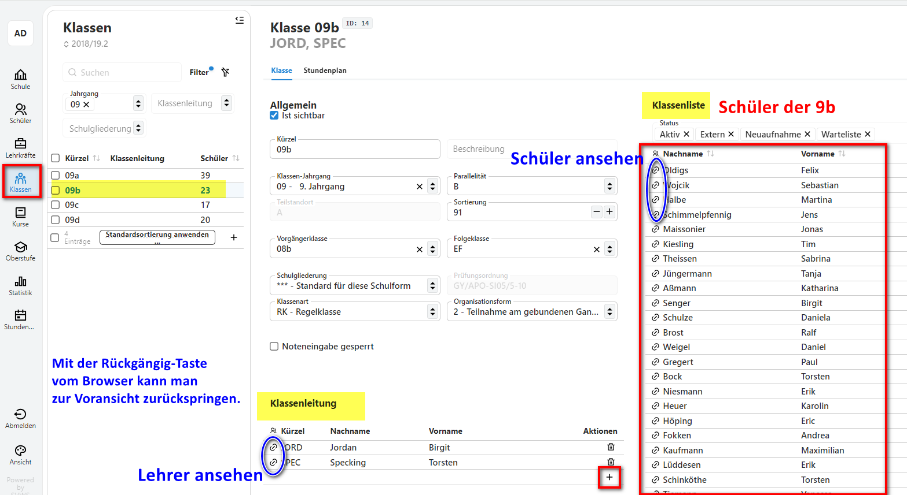
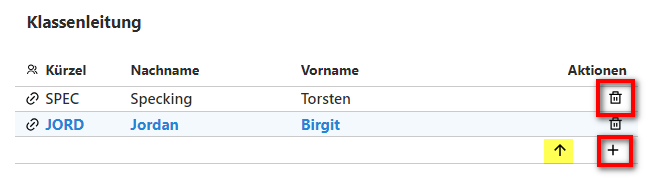
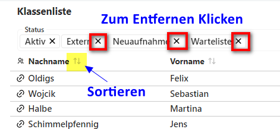

# Anpassungen bei den Schülerdaten

Die Schüler-App haben wir anfangs bereits kennengelernt. Nun wollen wir uns die verschiedenen Tabs etwas genauer anschauen. Da der Client stetig weiterentwickelt wird, können Screenshots von der aktuellen Client-Ansicht abweichen. 
 

## Statistik-relavante Felder
In der Schüler-App fällt auf, dass statistikrelevante Felder farbig hinterlegt sind. Die Farbe ist im Client nicht abänderbar und entspricht den Richtlinien der Barrierefreiheit.

In einer späteren Version erfolgt die Statistikprüfung für diese Felder unmittelbar beim Eintragen der Werte. Bereits jetzt erhält man für viele Felder eine Warnung, wenn fehlerhafte oder fehlende Einträge vorhanden sind:

 

## Wo finde ich was?
Die Struktur der Tabs unterscheidet sich von den Reitern in SchILD3. Einige Bereiche wurden logisch zusammengefasst wie beispielsweise das Zusammenlegen von *Individualdaten* I und II zum Tab *Individualdaten*. Andere Bereiche wurden separat aufgelistet wie beispielsweise die *Abschlüsse*. 
Um hier ein wenig die Orientierung zu bekommen folgen nun einige Aufgaben, die evtl. mit ein wenig herumklicken auch ohne die Hilfestellung gelöst werden können.

###  :a: Aufgabe - Migrationshintergrund
Tragen Sie den Migrationshintergrund eines Schülers aus der 8a nach: Der Schüler ist 2022 aus Ungarn nach Deutschland gezogen. 
::: details
Diese Angaben werden im Tab *Individualdaten* eingetragen.
:::

###  :a: Aufgabe - Datenanpassung von Erziehungsberechtigten
Ein Schüler aus der 5a ist umgezogen. Er wohnt nun auf der Hohestraße 53 in 43175 Bonn. Passen Sie seine Adresse und die seiner Eltern an.
::: details
+ Es gibt im Gegensatz zu SchILD3 keinen Bestätigungshaken. Die Änderungen werden unmittelbar in der Datenbank übernommen.
+ Um Daten der Erziehungsberechtigten anzupassen, muss man diese per Mausklick auswählen. 
:::

###  :a: Aufgabe - Förderschwerpunkt
Ein Schüler aus der 6b hat eine Sehbehinderung. Tragen Sie diesen Förderschwerpunkt entsprechend ein.
::: details
+ Diese Angaben werden im Tab *Lernabschnitte/Allgemein* eingetragen.
:::

Hinweis: Vielleicht ist es schon aufgefallen, dass im SVWS-Client die App *Kataloge* "fehlt". Da es sich bei sämtlichen Katalogen um Angaben bezüglich der eigenen Schule handelt, wurden diese der App *Schule* zugeordnet. Hier findet man nun auch die Bezeichnungen der Förderschwerpunkte:

 

###  :a: Aufgabe - Klassendaten ändern
 Unter Lernabschnitte sind zwar Angaben zum Klassenlehrer sichtbar, allerdings ist eine Änderung hier nicht möglich. Alle Angaben, die sich auf die gesamte Klasse beziehen, müssen in der Klassen-App angepasst werden:

 

 1. Ändern Sie den Klassenlehrer der Klasse 9b 
   ::: details
+ Löschen Sie zunächst den Klassenlehrer und fügen Sie anschließend einen anderen Lehrer hinzu. Mit dem Pfeil, kann navigiert werden, falls es einen stellvertretenden Klassenlehrer gibt.

 
+ 
:::
 2. Auf der rechten Seite sind alle SchülerInnen der 9b sichtbar. Lassen Sie sich alle aktiven SchülerInnen dieser Klasse anzeigen und sortieren Sie diese nach Nachnamen. 
 ::: details
 
:::
3. Springen Sie über den Link zu einem Schüler/Lehrer der Klasse 9b und betätigen Sie anschließend die "Rückgäng-Taste" vom Browser:

  
 
Das Link-Symbol findet man im SVWS-Client an vielen verschiedenen Stellen.

###  :a: Aufgabe - Einen Vermerk bei einem Schüler hinterlegen   
+ Definieren Sie die Vermerkart "Medikamenteneinnahme"
   ::: details
   Die Vermerkarten werden unter der App Schule/weitere Kataloge/Vermerkarten definiert:
     
    :::
+ Weisen Sie die Vermerkart drei Schülern zu
  ::: details
   Die Vermerkarten werden unter der App Schule/weitere Kataloge/Vermerkarten definiert:
     
    :::
+ Sichten Sie die Vermerkart erneut. Die Schüler werden bei der Auswahl der Vermerkart hier nun aufgelistet.

### :a: Aufgabe - Sprachenfolge

## Kataloge - Klassen-/ Versetzungstabelle
die sind hier wo anders

 

 Quartale

 :::

Zeugnisbemerkung
:::
     
::: info 
:exclamation: Die Nutzung von Reports ist nur über das Programm Schild-NRW3 möglich.
:::

"bulb"
:mag_right:
file_folder
key
question
:a:
hourglass"
stopwatch
stop_sign
globe_with_meridians
:sos:
:exclamation:
::: info
This is an info box.
:::

