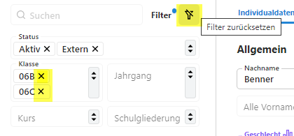
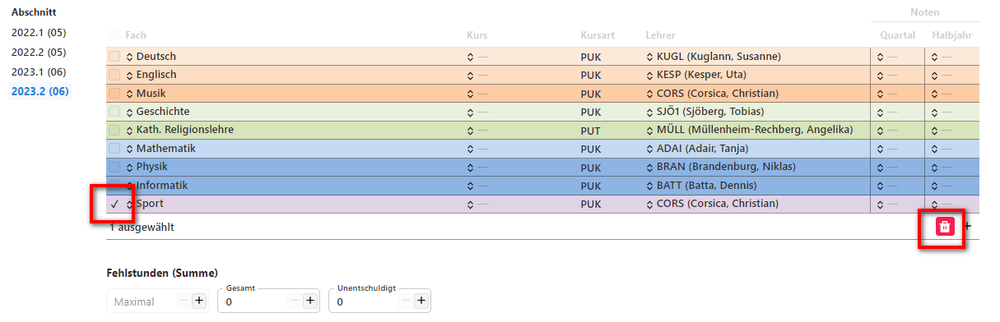

# SVWS-Client - Arbeiten mit dem Browser

Zusätzlich zu der Desktopanwendung SchILD-NRW3 kann die Schuldatenbank auch mit dem Browser geöffnet und bearbeitet werden.

## Öffnen der Datenbank im SVWS-Client
Öffnen Sie einen Browser (z.B. Google-Crome oder Firefox) und tippen Sie https://localhost in die Eingabezeile.

 

Sie sehen nun folgende Anmeldemaske:

Nach dem Klick auf Anmelden öffnet sich die Datenbank im Browser. Anders als mit der Desktop-Anwendung können Sie auf diesem Weg die Datenbank auch auf einem nicht Windows-basierten Betriebssystem öffnen.

Vor der Bearbeitung mit dem Webbrowser, kann die Darstellung den Bedürfnissen entsprechend angepasst werden:

#### Darstellungsgröße
* Mit *"Strg und +"* sowie *"Strg und -"* kann man die Schrift vergrößern bzw. verkleinern.

#### Ansicht
* links unten im Browser kann man über "Ansicht" die Skalierung und die Hell/Dunkelanicht anpassen:

## Übersicht
Analog zu SchILD-NRW3 findet man auf der linken Seite den Schülercontainer, sowie den Schnellfilter und im Zentrum die Individualdaten. 
Die Aufteilung und Anordnung der Reiter und Eingabefelder sind jedoch an vielen Stellen unterschiedlich. Beispielsweise wird nun nicht mehr zwischen Individualdaten I und II unterschieden.

Auf der linken Seite werden die zur Verfügung stehenden Apps aufgelistet. Beim Starten ist die Schüler-App aktiviert. Mit der linken Maustaste kann man eine App wechseln.

### Aufgabe 
* Filtern Sie die Klasse 6a und 6b.
* Entfernen Sie den Filter der Klasse 6a und fügen Sie die 6c hinzu.
* Entfernen Sie alle Filter und wählen Sie den Jahrgang 07 aus. Für das Entfernen der Filter gibt es verschiedene Möglichkeiten  

* Sichten Sie in der App "Schüler" im Tab "Sprachen" die Sprachenfolge eines Schülers in der Jahrgangsstufe Q1.  
Hier findet man nun auch sehr übersichtlich Angaben zum herkungssprachlichen Unterricht und zu Sprachen-Feststellungsprüfung. Konkrete Eingaben folgen später.(LINK!) 
* Löschen Sie bei einem Schüler im Tab "Lernabschnitte" das Fach Sport. 
Hinweis: Nach dem Markieren des Faches wird der Mülleimer sichtbar. Sie werden feststellen, dass keine Nachfrage erfolgt, ob das Fach wirklich gelöscht werden soll. 

* Bei einem Schüler aus der 7b wurde vergessen, den Migrationshintergrund einzutragen. Er wurde zwar in Deutschland geboren, aber seine Mutter kommt aus Ghana.

* Optional können Sie sich auch einmal die anderen Apps anschauen. Vieles wird Ihnen bekannt vorkommen. Aber ganz viel ist auch neu. Das werden wir später einmal genauer unter die Lupe nehmen.

