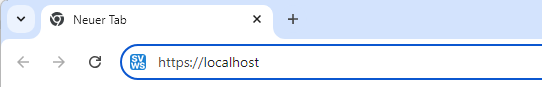

# SVWS-Client - Arbeiten mit dem Browser

Zusätzlich zu der Desktopanwendung SchILD-NRW3 kann die Schuldatenbank auch mit dem Browser geöffnet und bearbeitet werden.

## Öffnen der Datenbank im SVWS-Client
Öffnen Sie einen Browser (z.B. Google-Crome oder Firefox) und tippen Sie https://localhost in die Eingabezeile.

 

Sie sehen nun folgende Anmeldemaske:

graphics/vonS2nachS3_uebersicht_svwsClient_logIN.png) 

Nach dem Klick auf Anmelden öffnet sich die Datenbank im Browser. Dies geht natürlich auch mit anderen Betriebssystemen. 

Beim genauen betrachten stellt man schnell fest, dass vieles gleich geblieben ist zu SchILD2:
* Links befindet sich der gewohnte Schülercontainer
* Oberhalb vom Schülercontainer kann nach Klassen, Jahrgängen usw. gefiltert werden
*  Zentral werden die Individualdaten I dargestellt.
* Die aktuellen Laufbahndaten sind ebenfalls einsehbar. Alldings nun auf der rechten Seite, anstatt wie in SchILD2 unterhalb der Individualdaten.
* Die Tabs zum einzelnen Schüler sind überwiegend gleich geblieben:
Bild vom Schuelerkontainer/graphics/vonS2nachS3_uebersicht_schuelerreiter.png)  
Ein Tab Vermerke ist dazugekommen. Da kommen wir aber später nochmal zu.

### Aufgabe
* Filtern Sie die Klasse 6a.
* Heben Sie den Filter auf und filtern Sie den Jahrgang 7
* Klicken Sie den Schülerreiter für einen Schüler einmal durch, um mit der Oberfläche vertraut zu werden. Auf konkrete Änderungen werden wir später noch eingehen.

