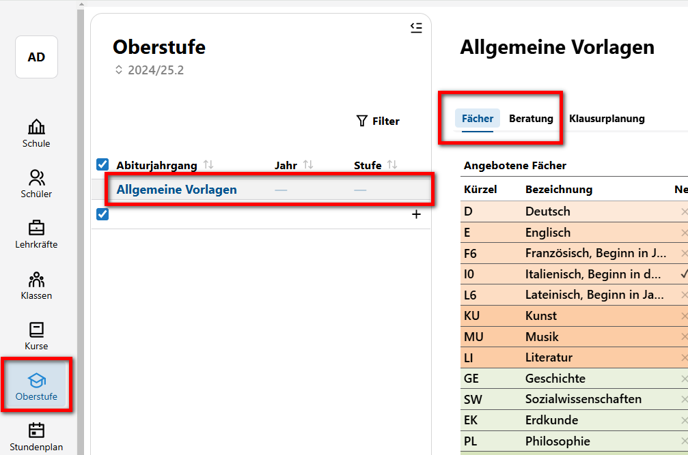

# 2. Vorbereitung in der App Oberstufe

Im folgenden wird eine **Allgemeine Vorlage** in der App Oberstufe erstellt. Anschließend folgt das Anlegen eines **konkreten Abiturjahrgangs**, und zwar den Abiturjahrgang für die kommende EF.  
In der allgemeinen Vorlage werden zunächst Standard-Einstellungen gesetzt, die in der Regel in allen konkreten Abiturjahrgängen gelten. Beispielsweise kann in der allgemeinen Vorlage festgelegt werden, dass das Fach Physik grundsätzlich nicht als Leistungskurs gewählt werden kann. Falls ein Physik LK für einen spezifischen Abiturjahrgang dennoch angeboten wird, kann dies später separat für diesen Jahrgang angepasst werden. 

## Allgemeine Vorlage

Die nachfolgenden Aufgaben beziehen sich überwiegend auf die App Oberstufe im Webclient. Die Tabs Fächer, Beratung und Klausurplanung können gemäß den Vorgaben Ihrer Schule angepasst werden. Alternativ finden Sie in jeder Aufgabe auch Beispielvorgaben, die Sie nutzen können. 

  
  
      

**Aufgabe 2.1 "Fächer der Oberstufe kontrollieren und korrigieren**:  
Sie haben bereits die Fächer der Oberstufe mit Hilfe von Schild3 bearbeitet. 
1. Sichten Sie alle Fächer der Oberstufe in der allgemeinen Vorlage.
2.  Ergänzen Sie Niederländisch als neu einsetzende Fremdsprache in der EF (oder ein/mehrere andere Fächer gemäß den Vorgaben an Ihrer Schule). Dies kann durchaus auch im Webclient realisiert werden.
3. Kontrollieren Sie die Stündigkeit - insbesondere bei den neu einsetzenden Fremdsprachen und korrigieren Sie diese ggf. 
4. Passen Sie die LK-Wahlmöglichkeiten sowie die Wahl des dritten und vierten Abiturfaches an. Gemäß den Vorgaben Ihrer Schule oder nach diesen Vorgaben:  
    + Musik soll auch als LK zur Auswahl stehen  
    + Physik kann nur als Grundkurs gewählt werden
    + Religion kann nicht im Abitur belegt werden
5. Richten Sie einen Projektkurs z.B. für das Fach Informatik mit Biologie als Leitfach. 

  

**Aufgaben 1.2 "Geforderte Kombinationen"**: Legen sie eine Fachkombination fest, die *gefordert* wird, hier wird ein Mathe LK an einen Physik Gk gekoppelt.

**Aufgaben 1.2 "Verbotene Kombinationen"**: Evangelische Religion und Katholische Religion schließen sich gegenseitig aus.

**Hinweis**: 
* Kombinationen müssen nur in einer Richtung verboten werden: Schließt ER KR aus, dann schließt auch automatisch KR ER aus.
* Kontrollieren Sie auch hier Ihre Fächer: Wenn es F6 nicht mehr gibt, muss hier z.B. F7 stehen.
* Änderungen zur Vorlage in *konkreten Jahrgängen* können dann dort immer noch vorgenommen werden.
* Vorgaben, die aus der APO GoST folgen, müssen hier nicht erneut als Regeln erstellt werden. Erstellen Sie nur so wenige Regeln wie möglich.

**Aufgaben 1.2 "Konkreten Jahrgang anlegen"**: Legen Sie nun einen konkreten Abiturjahrgang "Abitur 20XX" an, indem Sie auf das **+** klicken.

**Aufgaben 1.2 "Kontrollieren, ob es für diesen Jahrgang Abweichungen gibt"** (Eine Abweichung einstellen, ein Projektkurs könnte etwa an einen konkreten Beratungslehrer gekopppelt sein, und nun wird dieser PJK angeboten)

**Aufgaben 1.2 "Beratung"**: Im **Tab Beratung** kann nun eine Vorlage für alle Schüler erstellt werden mit Fachwahlen, die generell vorgegeben sind. Zum Beispiel müssen immer Deutsch und Mathe belegt sein, eventuell kann auch Sport schon überall "mündlich" eingetragen werden.

**Aufgaben 1.2 "Beratungslehrer"**: Legen Sie die Beratungslehrer für den Jahrgang fest.

**Aufgaben 1.2 "Prüfung Gesamt"**: Stellen Sie sicher, dass die Prüfung in der Vorlage auf *Gesamt* steht, da ansonsten nur die EF.1 geprüft wird und Sie nicht wissen, ob die Wahl eine gültige Laufbahn ergibt.

**Aufgaben 1.2. "Texte eintragen**: Tragen Sie Texte für den Mailversand bzw. für den Beratungsbogen ein (zum Beispiel zum Rücklaufdatum).

**Hinweis**: 

* der Jahrgang existiert jetzt neben eventuellen anderen Jahrgängen und der *Allgemeinen Vorlage*. Hier ist nun immer zu kontrollieren, ob man den richtigen Jahrgang gewählt hat.
* Die gemachten Einstellungen stehen nun im SVWS-Client bei der Laufbahnberatung und für WebLuPO zur Verfügung.
* Gehen wir in den **Tab Laufbahn** sind wir schockiert: Hier steht kein Schüler.

> [!TIP] 
> Hilfe finden Sie auch [hier](https://help.svws-nrw.de/gost/beratung/).