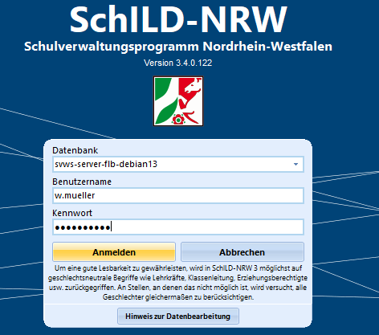
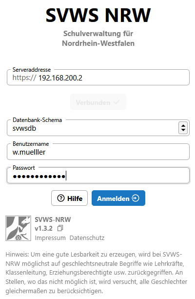

# 1. Orientierung in der neuen Version der Schulverwaltsungssoftware

## Einführung

> [!TIP] Moderationshinweis
> * Wie öffnet man den SchILD3-Client?
> * Wofür dient das Arbeitsverzeichnis (Verweis auf Reports, Exporte, Sicherungsordner)?

:a: **Aufgaben 0.1 "Schüler sichten mit SchILD3"**
+ Öffnen Sie SchILD3 und wählen Sie eine Datenbank aus.
  
+ Sichten Sie einige Schüler in SchILD3 und pflegen Sie folgende Änderungen ein:
    1. Ein Schüler aus der 8a (oder 2a) hat Religion abgewählt 
    2. Bei einem Schüler fehlt der Migrationshintergrund. Tragen Sie diesen nach.   
       Hinweis: Die Einstellung "vereinfachter Migrationshintergrund" wurde abgeschafft
    3. Fügen Sie bei einem Schüler einen Vermerk mit heutigem Datum hinzu.
    4. Nur relevant für weiterführende Schulen: Sichten Sie den Reiter Laufbahninfo. Tragen Sie für einen Schüler aus dem Abschlussjahrgang (z.B. aus der Q2 am Gymnasium)  die Sprache Spanisch (oder eine andere Sprache) in der Sprachenfolge nach. Ergänzen Sie ebenfalls für einen Schüler den Herkunftssprachlichen Unterricht "Polnisch".
    
:a: **Aufgaben 0.1 "Schüler sichten mit dem SVWS-Client"**
+ Öffnen Sie mit dem Browser die Website des SVWS-Client (z.B. direkt über die IP-Adresse des Servers als URL in der Adresszeile)
+ Melden Sie sich mit ihrem Benutzer an.
  
+ Sichten Sie einige Schüler. Gehen Sie hierzu oben links in den Suchfilter für Schüler. Geben Sie geeignete Suchkriterien ein und wählen Sie einzelne Schüler aus.
+ Ändern Sie analog zu o.g. Schritten die Eintragungen bei den ausgewählten Schülern.