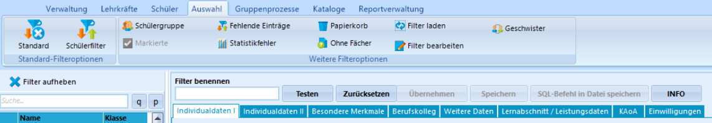
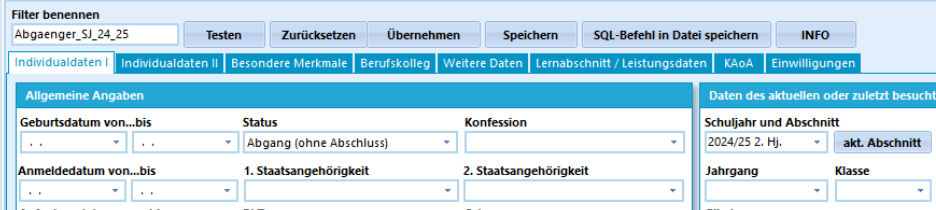
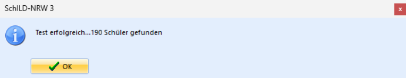
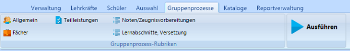
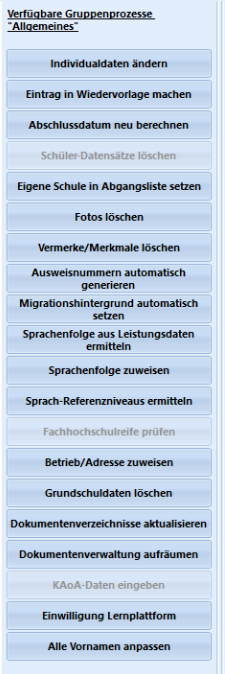
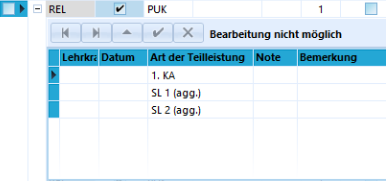

# 2. Filtern & Gruppenprozesse

## Filtern

> [!TIP] Moderationshinweis
> * Wozu benötige ich in Schild3 Filter ?
> * Wie lege ich neue Filter an, die ich später schnell wieder aufrufen kann?

**Aufgabe 2.1 "Schüler nach Merkmalen filtern"**:
+ Öffnen Sie Schild3 und wählen Sie eine Datenbank aus.
+ Klicken Sie in Schild3 auf "Auswahl". 
  

+ Definieren Sie nun einen neuen Filter mit dem Namen "Abgaenger_Sj_2024_25":
    1. Tragen Sie unter "Filter benennen" einen Filternamen ein.
    2. Wählen Sie unter "Individualdaten I" als "Status" "Abgang (ohne Abschluss)" aus.    
    3. Wählen Sie in den "Abschnittsdaten" als "Schuljahr und Abschnitt" den Wert "2024/25 2 HJ." aus.
    4. Klicken Sie danach den Button "Testen".
       

    5. Es wird die ermittelte Schüleranzahl ausgegeben, die auf die UND-verknüpften Suchkriterien passen.
       

    6. Klicken Sie nun den Button "Übernehmen", um mit den gefilterten Daten weiterzuarbeiten.

    

**Aufgabe 2.2 "Speichern Sie den getesteten Filter"**:
+ Gehen Sie wie in 2.1 beschrieben vor und speichern Sie Ihren Filter in sinnvoller Form für Ihre Schule.
+ Vergeben Sie einen eindeutigen Namen und eine für Ihre Schule hilfreiche Beschreibung.
+ Welche zusätzlichen Schritte sind erforderlich?
+ Was ist zu beachten, um nur getestete Filter dauerhaft zu speichern?

**Aufgabe 2.3 "Speichern Sie weitere Filter"**:
+ Gehen Sie wie in 2.1 beschrieben vor und erweitern Sie Ihre Filter. Wählen Sie hierzu mehrere Beispiele aus Ihrer Schule aus. 
+ Speichern Sie Ihre Filter.

**Aufgabe 2.4 "Laden und verändern Sie ihre Filter"**:
+ Klicken Sie in Schild3 auf Auswahl.
+ Laden Sie einen Ihrer Filter und wenden Sie diesen an.
+ Erweitern Sie danach die Filterkriterien und speichern Sie den Filter unter einem neuen Namen ab.
+ Welche Schritte sind erforderlich?

## Gruppenprozesse

> [!TIP] Moderationshinweis
> * Wozu sind welche Gruppenprozesse (GP) vorgesehen?
> * Welche GPs sollten im Sekretariat, bei der Zeugnisschreibung sowie Schulleitung geläufig sein?

**Aufgabe 2.5 "Erste Gruppenprozesse anwenden"**:
+ Öffnen Sie Schild3 und wählen Sie eine Datenbank aus.
+ Wählen Sie links über "Aktuelle Schülerauswahl" eine Klasse aus.
+ Klicken Sie danach in Schild3 auf "Gruppenprozesse". 
  

+ Es öffnet sich darunter ein Kontextmenü, in dem verfügbare Gruppenprozesse aufgelistet werden:

  Dies sind "Gruppenprozesse Allgemeines":
  

+ Für die Bereiche Fächer, Teilleistungen, Noten/Zeugnisvorbereitung und Lernabschnitte/Versetzung gibt es weitere GP.
+ Wählen Sie einen Gruppenprozess aus, um diesen auf die Auswahlmenge an Schülern (also z.B. die ausgewählte klasse) anzuwenden.
+ Wählen Sie als GP unter "Alggemeines" "Individualdaten ändern". Setzen Sie für die Schüler der Klasse die "Aktuellen Laufbahndaten" neu.
+ Führen Sie den GP mit dem Button "Ausführen" aus. 
+ Kontrollieren Sie bei den einzelnen Schülern der Klasse, ob die Änderungen übernommen wurden.

**Aufgabe 2.6 "Stundentafel den Schülern einer Klasse zuweisen"**:
::: Stundentafeln müssen zuvor unter "Kataloge" - "Stundentafeln" festgelegt worden sein. :::

+ Weisen Sie nun eine bereits definierte Stundentafel allen Schülern einer Klasse zu.
+ Wählen Sie links über "Aktuelle Schülerauswahl" eine Klasse aus.
+ Es wird gemäß der bei den Schülern eingetragenen Gliederung und Fachklasse eine verfügbare Stundentafel zur Auswahl dargestellt.
  
+ Wähle danach das Halbjahr aus, in dem die Stundetafel zugeordnet werden soll (z.B. Schuljahr: 2025/26 2. HJ.).
+ Kontrolliere das Ergebnis unter "Schüler" - " Aktuelle Schülerauswahl: Klasse" - "Halbjahr auswählen" - "Akt. Halbjahr" - "Leistungsdaten".
  
+ Klicken Sie vor dem jweiligen Fach auf das + - Zeichen, so werden die zugeordneten Teilleistungskaategorien aufgeklappt.

**Aufgabe 2.7 "GPs entdecken"**:
+ Wählen Sie links über "Aktuelle Schülerauswahl" eine Klasse aus.
+ Testen Sie mit dieser verschiedene Gruppenpropzesse aus den Bereichen "Allgemein", "Fächer","Teilleistungen" aus. 
+ Welche Nutzergruppe sollte mit welchem Prozess vertraut sein?

