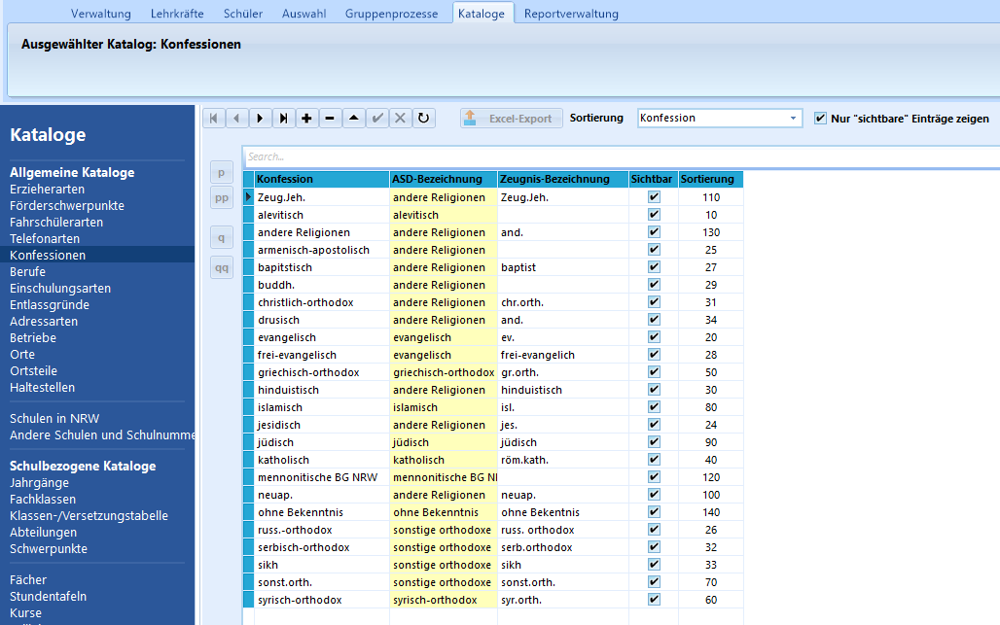
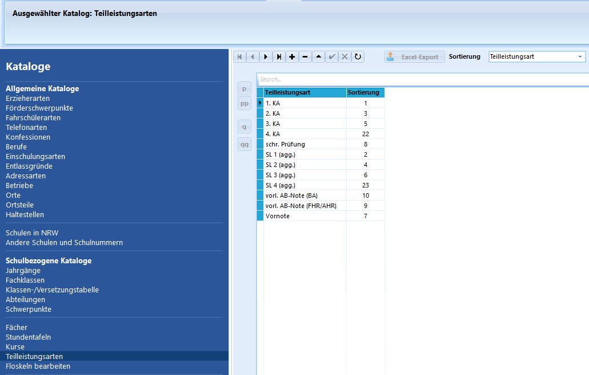
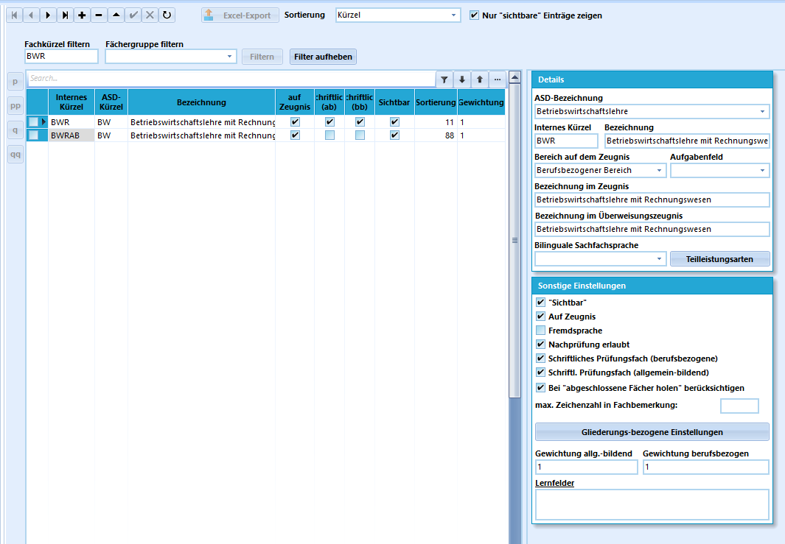
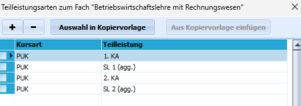
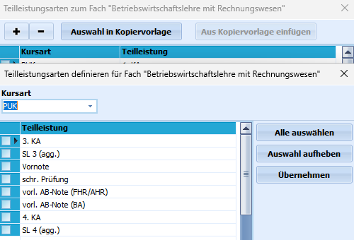

# 3. Kataloge

## Allgemeine Kataloge 

> [!TIP] Moderationshinweis
> * Wann nutze ich Kataloge ?
> * Wie kann ich fehlende Eintragungen in den Katalogen ergänzen?

:a: **Aufgabe 3.1 "Allgemeine Katalogen erkunden: Konfessionen"**
+ Öffnen Sie SchILD3 und wählen Sie eine Datenbank aus.
+ Klicken Sie in SchILD3 auf "Kataloge" und dann links unter "Allgemeine Kataloge" den Eintrag "Konfessionen". 
  

+ Orientierung:
    1. Der schware Pfeil vor der jeweiligen Konfessionszeile zeigt den aktuell ausgewählten Datensatz an.
    2. Deaktivieren Sie nun für diejenigen Religionen, die bisher an ihrer Schule Schülern nicht zugewiesen wurden, die Sichtbarkeit.
       Hierzu klicken Sie auf den Haken in der Spalte sichtbar, so dass dieser entfernt wird. 

    3. Oben rechts haben Sie ausgewählt, dass nur sichtbare Einträge angezeigt werden sollen. Sie müssen nun 
       den Button mit dem Pfeil mit der Spitze im Uhrzeigersinn klicken, um den Datenbestand neu zu laden.

    4. Es müsste nun eine Konfession weniger angezeigt werden. Zugleich wird bei den Schülern in den "Individualdaten I" die Auswahlliste für die "Konfession" 
       entsprechend verkürzt.

    5. Sollte diese später wieder benötigt werden, deaktivieren Sie oben den Haken bei "Nur "sichtbare" Einträge anzeigen" und
       aktivieren wieder den Haken in der Spalte "Sichtbar".

    6. Möchten Sie die Anzeige nicht nach der Spalte "Konfession" aufsteigend sortiert darstellen lassen,
       können Sie in der Spalte Sortierung Zahlen eintragen. Es wird dann von den kleinsten zu den größten Zahlen sortiert, wenn 
       Sie oben unter "Sortierung: Benutzerdefiniert" auswählen. 
       
    7. Sie können so z.B. eine Sortierung erreichen, die zuerst die besonders häufig auszuwählenden Konfessionen voranstellt und andere 
       danach darstellt. Dies spiegelt sich auch bei den Schülerdaten unter "Individualdaten I" in der Auswahlliste "Konfession" wieder.

    
:a: **Aufgabe 3.2 "Ergänzen Sie fehlende Ortsteile"**
+ Gehen Sie wie in 3.1 beschrieben vor und wählen Sie den Katalog Ortsteile aus.
+ Gehen Sie nun auf das Plus-Zeichen, um einen neuen Datensatz zu ergänzen.
+ Tragen Sie nun z.B. Morenhoven mit der Postleitzahl 53919 ein.
+ Ortsteile werden benötigt, wenn bei Schüleradressen eine Gemeinde mehrere Ortschaften ausweist.
+ In den Schülerdaten bei den "Individualdaten I" findet sich unterhalb des Datenfeldes "Ort" das Datenfeld "Ortsteil".
+ In Reports sollte darauf geachtet werden, dass dieses Datenfeld für die Adresse mit ausgegeben wird.

> [!TIP] Ergänzung von Katalogen
> * Sollte es erforderlich sein, in den Schulkatalogen einzelne Schulen nachzutragen, suchen Sie unbedingt vorher nach den korrekten Schulnummern:
    https://www.schulministerium.nrw.de/BiPo/SchuleSuchen/ 
> * Bei den Katalogen gilt es, bei Ergänzungen die Schlüsseltabellen der jeweiligen Schulform für die Statistik zu beachten: https://schulverwaltungsprogramme.msb.nrw.de/schulen/download.htm#D89

# Schulbezogene Kataloge 

> [!INFO] Moderationshinweis
> * Welche Kataloge benötigt unsere Schule regelmäßig?
> * Wann müssen hier Eintragungen ergänzt werden?

:a: **Aufgabe 3.3 "Schulbezogene Katalogen"**
+ Öffnen Sie SchILD3 und wählen Sie eine Datenbank aus.
+ Klicken Sie in SchILD3 auf "Kataloge" und dann links unter "Schulbezogene Kataloge" den Eintrag "Teilleistungsarten". 
  

+ Ergänzen Sie alle Teilleistungsarten, die an Ihrer Schule genutzt werden müssen.
+ Prüfen Sie, wann welche Teilleistungsart an Ihrer Schule in welchen Fächern und Bildungsgängen einzusetzen ist.

:a: **Aufgabe 3.4 "Teilleistungsarten bei Fächern ergänzen"**
+ Gehen Sie unter "Kataloge" - "Schulbezogene Kataloge" - auf "Fächer".
+ Wählen Sie ein Fach über "Fachkürzel filtern" aus.
  
+ Klicken Sie rechts in den Details des ausgewählten Faches auf den Button "Teilleistungsarten".
  
+ Ergänzen Sie über das Plus-Zeichen weitere Teilleistungsarten. Wählen Sie zunächst die Kursart aus, bei vielen Fächern ist dies PUK (Unterricht im Klassenverband).
+ Es werden ihnen weitere Teilleistungsarten aus dem Katalog angezeigt, die Sie noch dem Fach als Vorlage zuordnen können.
  
+ Setzen Sie vor denjenigen Teilleistungen einen Haken, die Sie dem Fach zusätzlich zuordnen möchten. Klicken Sie dann auf "Übernehmen".
+ Kontrollieren Sie die Eintragungen, indem Sie bei dem Fach erneut auf die Teilleistungsarten klicken. Es sollten nun alle erforderlichen TL angezeigt werden.

:a: **Aufgabe 3.5 "Teilleistungsarten bei Fächern ergänzen"**
+ Wählen Sie "Schüler" aus und tragen dort unter "Aktuelle Schülerauswahl" eine Klasse Ihrer Wahl ein.
+ Klicken Sie nun auf "Gruppenprozesse" und suchen Sie nach dem geeigneten Gruppenprozess, um die im Fach als Vorlage zugeordneten Teilleistungsarten, 
  den Schülern einer Klasse in den Leistungsdaten zuzuordnen. 
+ Welcher GP ist dies und wie ist dieser anzuwenden?
+ Wie können Sie kontrollieren, ob die Teilleistungsarten in den Fächern den Schülern wirklich zugeordnet wurden?

