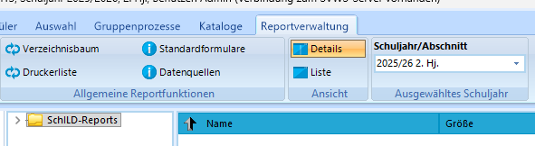
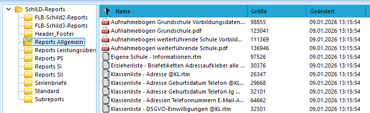
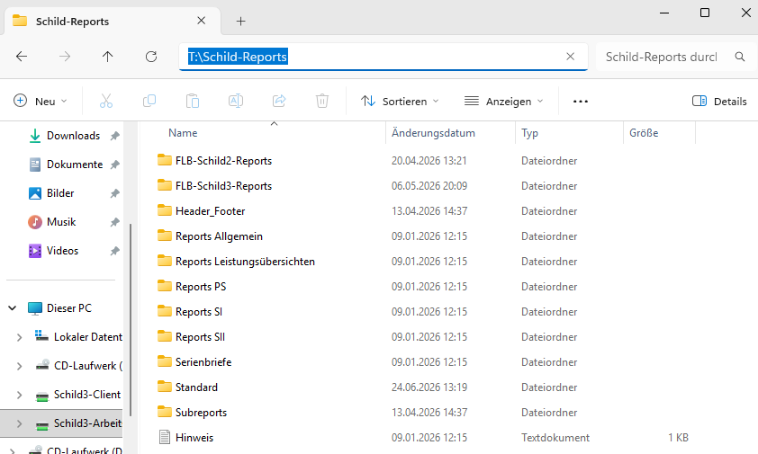
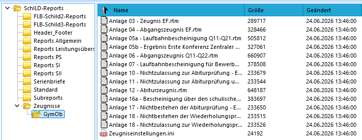
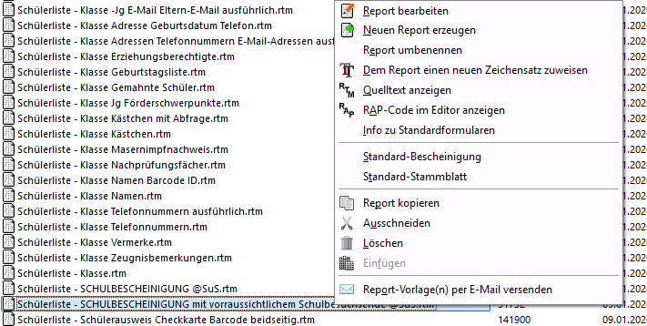

# 4. Reports

> [!TIP] Moderationshinweis
> * Wo liegen die Reports?
> * Wie kann ich die Stuktur der bereitgestellten Reports anpassen?
> * Welche Einstellungen kann ich anpassen?
> * Wie nutze ich bestehende Reports

:a: **Aufgabe 4.1 "Finden Sie heraus, welche Reports bei Ihnen bereits genutzt werden können."**
+ Öffnen Sie SchILD3 und wählen Sie eine Datenbank aus.
+ Klicken Sie in SchILD3 auf "Reportverwaltung" und erweitern Sie den Verzeichnisbaum unterhalb des Ordners "Schild-Reports".
  
+ Welche Reports werden in Ihrer Schule bereits für SchILD3 zur Verfügung gestellt? 
  

:a: **Aufgabe 4.2 "Erweitern Sie die Ordnerstruktur ihrer Reports."**
+ Öffnen Sie das Netzlaufwerk oder den lokalen Ordner "SVWS-Arbeitsverzeichnis" mit dem Datei-Explorer.
  
+ Legen Sie im Verzeichnis "Schild-Reports" ein neues Unterverzeichnis "Zeugnisse" an.
+ Laden Sie hier (https://www.svws.nrw.de/svws-server-schild-nrw-3/reports-zeugnisse-fuer-schild-nrw-3-als-download) die bereitgestellten Zeugnis-Reports für Schild3 für Ihre Schulform herunter. Entpacken Sie diese in das neu angelegte Verzeichnis.
+ Klicken Sie nun in SchILD3 in der "Reportverwaltung" auf "Verzeichnisbaum", damit dieser neu eingelesen wird, erweitern Sie wieder die Ansicht auf die Unterordner.
+ Prüfen Sie, welche Zeugnis-Reports Ihnen nun zur Verfügung stehen. Klicken Sie hierzu auf den Ordner "Zeugnisse" unterhalb der "Schild-Reports".
  

:a: **Aufgabe 4.3 "Legen Sie Standard-Reports fest."**
+ Öffnen Sie SchILD3 und wählen Sie eine Datenbank aus.
+ Klicken Sie in SchILD3 auf "Reportverwaltung" und erweitern Sie den Verzeichnisbaum unterhalb des Ordners "Schild-Reports".
+ Suchen Sie sich nun einen geeigneten Report für den Druck des Schüler-Stammblattes sowie der Schulbescheinigung aus (z.B. im Ordner Reports-Allgemein").
+ Markieren Sie den Report, den Sie für das Schüler-Stammblatt verwenden wollen. Klicken Sie nun mit der rechten Maustaste und wählen sie aus dem Kontextmenü "Standard-Stammblatt".
+ Markieren Sie den Report, den Sie für die Schulbescheinigung verwenden wollen. Klicken Sie nun mit der rechten Maustaste und wählen sie aus dem Kontextmenü "Standard-Bescheinigung".
  

> [!TIP] Anpassung der Standard-Reports bei einer migrierten Datenbank
> * Haben Sie zuvor SchILD2 genutzt und ihre Datenbank wurde für den SVWS-Server migriert, müssen Sie ggf. die Pfade für die Standard-Formulare einmal zurücksetzen, bevor Sie diese neu setzen könne.
> * Gehen Sie hierzu in SchILD3 auf "Verwaltung", dann auf "Einstellungen" - "Individuelle Einstellungen". Dort gibt es eine Rubrik "Andere" mit dem Eintrag "Individuelle Einstellungen zurücksetzen". Klicken Sie diesen Button, beenden Sie die SchILD3 und starten Sie das Programm neu. Danach setzen Sie wie zuvor beschrieben die Standard-Reports erneut fest.

:a: **Aufgabe 4.4 "Drucken Sie eine Schulbescheinigung aus."**
+ Öffnen Sie SchILD3 und wählen Sie eine Datenbank aus.
+ Wählen Sie in SchILD3 unter "aktuelle Schülerauswahl" einen Schüler aus einer Klasse aus. Klicken Sie nun oben rechts auf Schulbescheinigung.
+ Lassen Sie sich die Schulbescheinigung für den aktueell ausgewählten Schüler anzeigen.

