# 5. Noteneingabe

> [!TIP] Moderationshinweis
> * Wie werden Noten im SVWS-Server verwaltet?
> * Wie gebe ich Noten mit SchILD3 ein?
> * Wie gebe ich Noten mit dem SVWS-Client ein?

Zunächst ist es für die spätere Fehlersuche hilfreich nachzuvollziehen, wie die Leistungsdaten im SVWS-Server verwaltet werden. 
Die Noteneingabe unterscheidet sich mit dem SVWS-Client grundsätzlich von der Eingabe mit dem SchILD3-Client. Diese wird nachstehend beschrieben.

Die externe Noteneingabe mit dem [WeNoM - WebNotenManager](https://doku.svws-nrw.de/wenom/benutzerhandbuch/anleitung_lehrkraefte.html), einer Online Plattform zur Erfassung und Verwaltung der Noten und Zeugniseintragungen, kann anhand der verfügbaren Dokumentation nachvollzogen werden.

# Leistungsdatenverwaltung im SVWS-Server

+ Im SVWS-Server werden alle Leistungsdaten in Lernabschnitten organisiert. Gegenüber SchILD2 werden Quartale als Abschnittsebene nicht mehr unterstützt. Es werden nunmehr Halbjahre als Abschnitte dargestellt. Quartale können in diesen Abschnitten in einer Spalte ebenfalls dargestellt werden. Ob diese sichtbar sein sollen, kann über die Einstellungen gesteuert werden.
+ Lernabschnitte könne frei benannt werden (z.B. "Halbjahr", "Abschnitt").
+ Alle Leistungen und Ergebnisse der Versetzungs- und Abschlussberechnungen werden getrennt je Lernabschnitt gespeichert. Hierdurch ist es möglich vergangene Lernabschnitte ggf. neu zu berechnen.
+ Nachstehende Abb. verdeutlicht die Zuordnungen:
  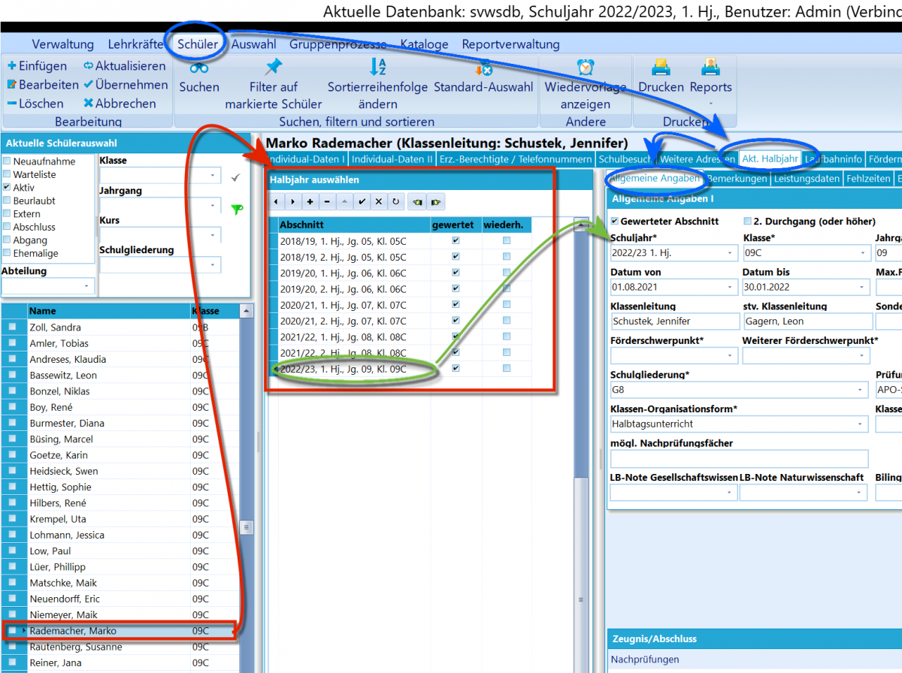

:a: **Aufgabe 5.1 "Leistungsabschnitte an unserer Schule"**

+ Öffnen Sie SchILD3 und wählen Sie eine Datenbank aus.
+ Klicken Sie auf den Reiter "Schüler".
+ Wählen Sie links im Bereich "Aktuelle Schülerauswahl" eine Klasse mit aktiven Schülern aus.
Wählen Sie in der Ergebnisliste einen Schüler aus.
+ Auf der Reiterkarte "Individualdaten I" sehen Sie unter "Aktuelle Laufbahndaten" den aktuellen Lernabschnitt.
  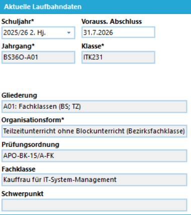
+ Klicken Sie für diesen Schüler nun auf die Reiterkarte "Akt. Halbjahr".
+ Sie sehen nun die bisherigen Lernabschnitte des Schülers.
  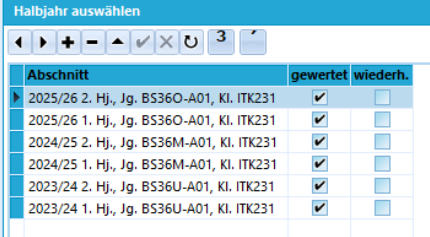
+ Das aktuell ausgewählte Halbjahr wird in obiger Abb. durch den vorangestellten schwarzen Pfeil und einer Hintergrundschraffur gekennzeichnet.

# Noteneingabe mit SchILD3

:a: **Aufgabe 5.2 Eingabe einzelner Teilleistungen und Noten**

+ Wählen Sie eine Schülermenge mithilfe der unter [Filtern & Gruppenprozesse](./2_Filtern_Gruppenprozesse.md) dargestellten Verfahren aus.
+ Wählen Sie dann einen Schüler wie in Aufgabe 5.1 vorbereitet aus.
+ Klicken sie im rechten Unterfenster des Reiters "Akt. Halbjahr" auf die Reiterkarte "Leistungsdaten".
+ Wählen Sie dann das Fach aus, für das Sie für diesen Schüler Teilleistungen (TL) oder Noten eintragen möchten.
  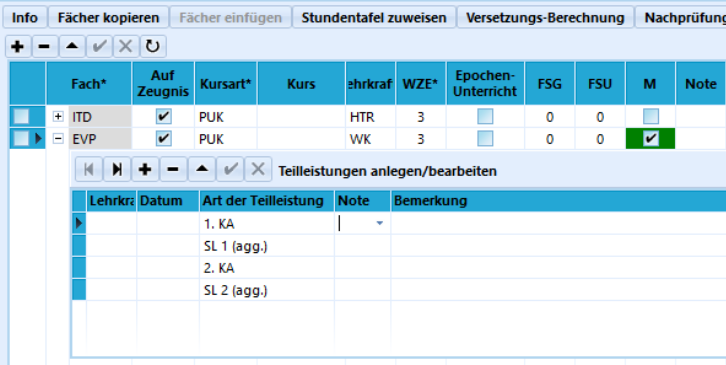

::: details

+ Klicken Sie auf das + - Zeichen vor der Fachbezeichnung, um die zugeordneten Teilleistungen aufzufächern.
+ Klicken Sie nun in die Spalte "Note" der Teilleistungsart (z.B. 1. KA) für die Sie Noten eintragen möchten.
+ Sie können nun die Note direkt eintragen, oder aus dem Drop-down Menü auswählen. 
+ Dies ist aber nur möglich, wenn Sie bei SchILD3 als angemeldeter Lehrer dem Fach zugeordnet, 
  das Fach für den Schüler angelegt und Teilleistungen zugewiesen wurden.

:::

:a: **Aufgabe 5.3 Eingabe der Teilleistungen eines Faches pro Klasse**

+ Wählen Sie eine Schülermenge mithilfe der unter [Filtern & Gruppenprozesse](./2_Filtern_Gruppenprozesse.md) dargestellten Verfahren aus.
+ Klicken Sie die Reiterkarte "Gruppenprozesse", danach im oberen Teil "Teilleistungen". 
  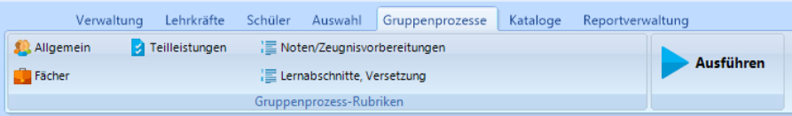
+ Klicken Sie nun in der Liste der "verfügbaren Gruppenprozesse - Teilleistungen" auf "Noteneingabe (nur vorbereitete TL)".
   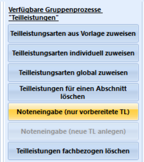

::: details

+ Wählen Sie in dem neuen Fenster "Teilleistungsnoten eingeben" das gewünschte Fach und die gewünschte Teilleistungsart aus.
+ Klicken Sie danach auf aktualisieren. Es erscheinen dann alle Schüler, der gewählten Schülermenge, die dem Fach zugeordnet sind.
+ Wählen Sie oben rechts das Datum der einzutragenden Teilleistungsart und klicken Sie auf Datum übernehmen.
+ Klicken Sie danach für den ersten Schüler in die Spalte "Note" und tragen Sie nun die Noten für diese Teilleistungsart für die gesamte Klasse ein.
+ Tragen Sie die Note ein und betätigen Sie die Pfeiltaste nach unten, um die Eingabe zu übernehmen und in die Notenzeile für den nächsten Schüler zu gelangen.
+ Zum Abschluss der Eintragung müssen Sie noch unten rechts auf den Button "In Datenbank übernehmen" klicken, damit alle Eintrageungen nun auch übertragen werden.

:::

:a: **Aufgabe 5.4 Eingabe der Zeugnisnoten eines Faches pro Klasse**

+ Wählen Sie eine Schülermenge mithilfe der unter [Filtern & Gruppenprozesse](./2_Filtern_Gruppenprozesse.md) dargestellten Verfahren aus.
+ Klicken Sie die Reiterkarte "Gruppenprozesse", danach im oberen Teil "Noten/Zeugnisvorbereitungen".
+ Klicken Sie nun in der Liste der "verfügbaren Gruppenprozesse - Noten/Zeugnisvorbereitung" auf "Noten, Mahnungen und Fehlstunden eingeben".
  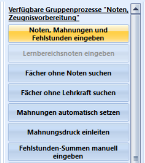  

::: details

+ Wählen Sie nun den gewünschten Abschnitt aus. Es wird zunächst das aktuelle Schulhalbjahr angezeigt.
+ Klicken Sie nun in der Liste der "verfügbaren Gruppenprozesse - Noten/Zeugnisvorbereitung" auf "Noten, Mahnungen und Fehlstunden eingeben".
+ Es öffnet sich nachstehendes Fenster:
   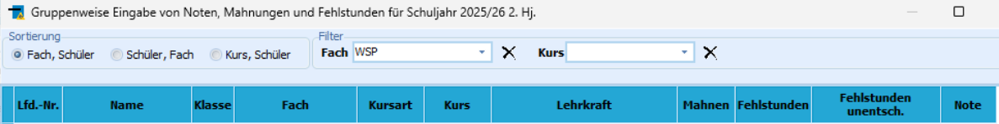  
+ Wählen Sie hier das gewünschte Fach aus. Darunter erscheinen dann alle Schüler der Klasse, die dem Fach zugeordnet wurden.
+ Klicken Sie danach für den ersten Schüler in die Spalte "Note" und tragen Sie nun die Noten für diese Teilleistungsart für die gesamte Klasse ein.
+ Tragen Sie die Note ein und betätigen Sie die Pfeiltaste nach unten, um die Eingabe zu übernehmen und in die Notenzeile für den nächsten Schüler zu gelangen.
+ Zum Abschluss der Eintragung müssen Sie noch unten rechts auf den Button "In Datenbank übernehmen" klicken, damit alle Eintrageungen nun auch übertragen werden.

:::

# Noteneingabe mit dem SVWS-Client

:a: **Aufgabe 5.5 Eingabe einzelner Teilleistungen und Noten**

+ Rufen Sie im Webbrowser die Webseite des SVWS-Client auf. Dies ist in der Regel die IP-Adresse des SVWS-Servers.
+ Melden Sie sich am SVWS-Server und der gewünschten Datenbank an.
  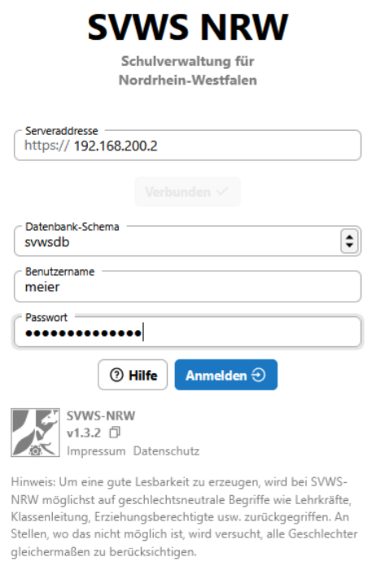  
+ Wählen Sie links im Menü des SVWS-Client die App "Noten" aus.
  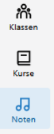   
+ Wählen Sie in der zweiten Fensterspalte unter "Noten" den gewünschten Lernabschnitt.
  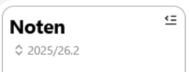   
+ Danach klicken Sie bei der "Noteneingabe" auf "Teilleistungen" oder auf "Leistungsdaten", um die jeweils gewünschten Noten einzutragen.
    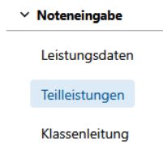

::: details

+ Tragen Sie nun in der nächsten Spalte in das Suchfeld die gewünschte Klasse ein.
   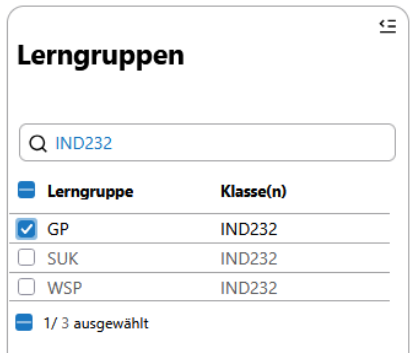
+ Markieren Sie das Fach in der Klasse, für das Sie Noten eintragen möchten.
+ Für dieses Fach wird nun die Klassenliste mit den Teilleistungsarten angezeigt.
  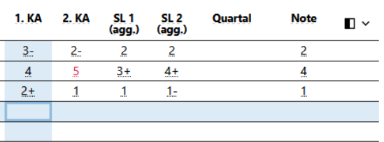

+ Tragen Sie nun für die Teilleistungsarten die Noten ein.
+ Hierzu müssen Sie nur in die jeweiligen Felder klicken und die Eintragungen vornehmen.
+ Um zwischen den Feldern in einer Zeile zu springen, können Sie die Tabulator-Taste nutzen.
+ Nach Wechsel des Feldes ist die Note bereits gespeichert.

:::